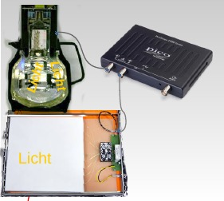

# picoCosmo

*python* script to analyze data from CosMO detectors and Kamiokanne 
by Netzwerk Teilchenwelt with picoScope USB device

   

This is the **English Version** of the documentation.

For German readers:  
Die **deutsche Version** dieses Dokuments findet sich unter dem Link  [README_de.md](README_de.md).

The software is tailored to identify short pulses from muon detectors (the scintillator panels of the *CosMO*-experiment by "Netzwerk Teilchenwelt", <http://www.teilchenwelt.de>, or the *Kamiokanne*-Experiment (a water-Cherenkov detector with photomultiplier readout) with a PicoScope USB oscilloscope with two or four channels.

Reading out Geiger Counters or detectors for gamma rays, e. g. the GDK 101 PIN diode counter, is also
possible with the this software. 

Data is read from the PicoScope device via a Buffer Manager, see project *picoDAQ* (<https://github.com/GuenterQuast/picoDAQ>), which records waveforms and distributes them to consumer processes. The consumers either provide real-time displays of a sub-set of the data or perform data analysis. *PiocoCosmo* is a specialised and extended version of the script *runDAQ.py* from project *picoDAQ*.

The analysis proceeds in three steps. First, the trigger is validated by cross-correlation with a signal template located around the trigger time. Next, coincidences near a validated triggering pulse are searched for in all connected channels. The optional third step performs a search for additional pulses after the triggering event, indicating the decay of a stopped muon in or near the detector.

The software provides real-time displays of waveforms, detector signals and rates. Optionally, parameters of identified pulses or of double-pulses are written to files in CSV format. In addition, raw waveforms or pictures in *.png* format of identified double pulses can optionally be stored for off-line analysis or for an instructive analysis "by hand" based on the waveform pictures. From this information, the mean muon lifetime in the muon rest frame (2.2 µs) can be derived. 


## Dependence on other packages

This code relies on

  - the data acquisition and analysis package picoDAQ, <https://github.com/GuenterQuast/picoDAQ>, which
    must be installed on your system, together with
  - the  *python* bindings of the *pico-python* project by Colin O'Flynn, see <https://github.com/colinoflynn/pico-python> and
  - the low-level drivers and C-libraries contained in the Pico Technology Software Development Kit, see
    <https://www.picotech.com/downloads>

The code also runs on a Raspberry Pi. 

## Installation

  - Install the PicoTech Software Development Kit from
    <https://www.picotech.com/library/oscilloscopes/picoscope-software-development-kit-sdk>.
  - Install the *pico-pyhton* package from
    <https://github.com/colinoflynn/pico-python>.
  - Install the picoDAQ package, vers. >= 0.7.2 from
    <https://github.com/GuenterQuast/picoDAQ>.
  - Download all files from this project
    <https://github.com/GuenterQuast/picoCosmo>.

For your convenience, the sub-directory *libs/whl/* contains compatible versions of
*picoscope* from package *pico-python* and  *picodaqa* from package *picoDAQ* as
python-wheels. 

The *PicoTech* driver libraries for the #Raspberry Pi# are located
in the directory *libs/RasPi/picoscopelibs*. Execute the script
*installlibs_RasPi.sh* to install all necessary components on a Raspberry Pi.

By executing the script *install_user.sh* a working directory ~/picoCosmo is set up. Initally, this
directory contains examples of configuration files for different detectors or combinations
of detectors: 

- the Phywe version of Kamiokanne (*PhyweKanne.daq*)
- Kamiokanne with a fast signal from a photomultiplier or a silicon photomultiplier (SiPM)  (*Kanne.daq*)
- the CosMO panels (*Cosmo.daq* or *Cosmo2000.daq* for a PicoScope A series)
- for one CosMo-panel with Kamikanne (*Kanne-plusPanel.daq*)
- for the GDK 101 gamma ray detector (*GammaCounter.daq* or GammaCounter2000.daq for the A-series)


## Program Execution

To run *picoCosmo* from the graphical interface, create the subdirecotry *picoCosmo* in your home directory, where modified configurations and output are stored: 

     cd 
     mkdir picoCosmo

Now you are ready to execute the graphical interface of *picoCosmo*:

    <picoCosmo install directory>/CosmoGui.py


Alternatively you may change to the *picoCosmo* installation directory 

    cd  <picoCosmo install directory>

and start *./runCosmo.py*  from the command line.

Both scripts are controlled by an input file in *.daq* format, which specifies the
configuration:

  - Cosmo.daq : configuration for Cosmo-Panels
  - Kanne.daq : configuration for Kamiokanne

These files contain the names of files for the configurations of the PicoScope device, the Buffer Manager and the Pulse Filter.

The graphical interface allows to inspect and modify the configurations, to select a working directory for the output files and to start a new run.  Configuration and output files are stored in a newly created sub-directory *<Run Tag>_<date>/* in the selected working directory, where a  specific *<Run Tag>* can be defined by the user.


## Configuration and program execution

As stated above, data Acquisition and Analysis is started using the graphical interface by typing `<picoCosmo installation directroy>/CosmoGui.py xxx.daq`.
If no configuration is given, the file *default.daq* is used. Optionally, a run can also be started by directly executing `./runCosmo xxx.daq` from the *picocCosmo* installation directory.

After run start, control is performed via the main window of the BufferManager, which contains the options *Pause*, *Resume*, *Stop* and *EndRun*. In stopped state, all windows remain open and graphs may be saved and log-output inspected. In End-state, all processes are stopped, and consequently all windows disappear. Resume running from Stop-state is presently not foreseen.

The helper scripts, *plotDoublePulses.py* and *makeFigs.py*, allow to read stored raw waveforms in text or zip format from the double-pulse search and display resp. store them as images in *.png* format.

The configuration for *runCosmo.py* is defined in several *.yaml* files contained in sub-directory *config/**. The files used for a specific configuration are listed in files of type *.daq* , e. g. *Kanne.daq* for Kamiokanne and *Cosmo.daq* for a run with the CosMo panels.

The  *.yaml* files specify configurations for the oscilloscope, the BufferManager and the Pulse Filter. Here is a general example:

```
# file default.daq
# --------------------
# configuration files for data acquisition and real-time analysis 

DeviceFile: config/PSconfig.yaml   # Oscilloscope configuration file
BMfile:     config/BMconfig.yaml   # Buffer Manager configuration
PFfile:     config/PFconfig.yaml   # Pulse Filter Configuration 
```

The oscilloscope configuration specifies the oscilloscope model, the active channels, trigger condition and the number of samples and total sampling time for each trigger:

```yaml
# file PSconfig.yaml
# ------------------   
# PicoScope configuration for two channles (~150ns pulses, <300mV)

PSmodel: '2000a'                  # model type (2000a is default, for PS 220xB and 240xB)

# Channel configuration  
picoChannels: [A, B]              # active channels
## picoChannels: [A, B, C]        # for 4-channel scope
ChanModes:     [AC, AC, AC]       # AC or DC coupling
ChanRanges: [0.2, 0.2, 0.2]       # range 
ChanOffsets: [0.14, 0.16, 0.15]   # offset (not for model 2204x)
ChanColors: [darkblue, sienna, indigo]  # optional: colors for graphical display

## Trigger configuration
trgChan: A
trgThr: -40.E-3
trgTyp: Falling
pretrig: 0.05                     # % of samples stored before trigger (not for model 2204x)

## data acquition 
Nsamples: 4000                    # number of samplings per trigger
sampleTime: 16.E-6                # total sampling time; time distance between two sampling
#     in seconds, scientific      #  is nearest valid setting given by sampleTime/Nsamples
#     format with . and
#     and signed exponent
```


The configuration for the Buffer manager allows to specify the number of buffers, the display modules for raw data and the logging level:

```yaml
# file BMconfig.yaml
# ------------------
# configuration of picoDAQ Buffer Manager 

NBuffers: 16         # number of buffers to store raw waveforms
BMmodules: [mpOsci]  # BufferMan modules to start
verbose: 1           # set verbosity level
LogFile: BMsum       # name of log-file, null to disabl
```


The configuration for running with the CosMO detectors or Kamiokanne are specified in the PulseFilter configuration file. It contains 

- the specification of desired output files;

- the pulse parameters (shapes, pulse heights and possibly a delay) for every connected channel;

-  the display modules to be started:  rate meter of accepted events,  a pulse height display, and the definition of  histograms for pulse heights, muon rate and muon life-time.  

  A general example with all presently implemented configuration options is shown here: 

```yaml
# file PFconfig.yaml
# -------------------
# demo configuration file for PulseFilter
#    documents all options

## output files  (specify null to disable)
logFile: pFilt    # store parameters of all pulses
logFile2: dpFilt  # store parameters of identified double-pulse
# special for double pulse search:
rawFile:  dpRaw    # store raw wave-forms
pictFile: dpFigs   # save pictures of double pulses

## pulse parameters 
#              ____
#             /    \  
#    ____, _ /_ _ _ \_ _ _ _ _ _  
#                    \_______/   
#      d     r  on f f2 off r2
#                 
#       d is optional, as well as f2, off and r2 for bipolar pulses
#
# list of dictionaries for pulse shapes per channel
pulseShape:
# channel A:
 - pheight: -0.040
   taur   : 20.E-9
   tauon  : 12.E-9 
   tauf   : 128.E-9
   OffsetSubtraction: true # opt., subtract dc offset for uni-polar pulse (default)

# channel B: 
 - pheight: -0.040
   taur   : 20.E-9
   tauon  : 12.E-9 
   tauf   : 128.E-9 
   delay  : 0.000       # optional: delay w.r.t. trigger channel
   OffsetSubtraction: true # subtract dc offset for uni-polar pulse (default)

# possibly a dedicated shape for the triggering pulse
trgPulseShape:
# trigger pulse
 - pheight: -0.040
   taur   : 20.E-9
   tauon  : 12.E-9 
   tauf   : 128.E-9 

# precision of timing between channels (optional)
timingPrecision: 2 # in units of sampling interval, default is 2

## criteria to accept event (optional)
# remove '#' to enable one of the keys below
#NminCoincidence: 2 # min nbr of coincidences to accept event, default is 2
#    alternatively: 
#    pattern of pulses required near trigger pulse (overwrites NminCoincience)
#acceptPattern:     
# - [1, 1]  # valid pulse chanA and ChanB
# - [0, 1]  # not ChanA and ChanB
# - [1, 0]  # ChanA and not ChanB

## display modules to start and options
modules: [RMeter, Display, Hists]
#    rate meter, display of signal size, historgrams
# --- for rate meter
RMeterInterval:  2.5  # update interval in sec.
RMeterRate:  12.      # max rate in Hz
RMeterTitle: 'rate history (s)'
# --- for histograms
histograms:
  # min max Nbins ymax    title              lin/log
 - [0., 0.4, 50, 20., "noise Trg. Pulse (V)", 0]
 - [0., 0.8, 50, 15., "valid Trg. Pulse (V)", 0]
 - [0., 15.,  45, 7.5, "Tau (µs)", 1]
 - [0., 0.8, 50, 15., "Pulse Height (V)", 0]

## analysis options
doublePulse: true  # switch to control double-pulse search

```


## Example output

The directory *./output* contains the results from a long run of almost 20 days with the Kamiokanne detector and a one-day run with the CosMO panels. The compressed file *rawDP_<date>.dat.zip* contains the raw wave forms of identified double-pulses in *yaml*-format. The scripts *plotDoublePulses.py* and *makeFigs.py* can be used to read the zipped file and to produce graphical displays or images in *.png* 
format of the waveforms.

The parameters of events containing double-pulses are stored in file *dpKanne2_180403.dat*. An unbinned log-likelihood fit of measured lifetimes between 1.5 µs and 15. µs with the script *fit_dpData.py* yields the result shown in figure *life-ofMU_<date>.png*.

The *pyhton* script *RateAnalysis.py* provides a statistical analysis of the arrival times of the recorded events
Input is the  *PulseFilter* logfile. The file
 *Kanne_180403/pFilt_Kanne.dat*
contains the results for a short run; the command 
*./RateAnalysis.py Kanne_180403/pFilt_Kanne.dat* displays the graphs.


## Running on Raspberry Pi

*picoCosmo* also runs on the very popular Rasbperry Pi single board computer. After setting up your Raspberry Pi, the following steps should be taken to update and install all necessary packages (latest Debian releases *stretch* and *buster*):

```bash
sudo apt-get update
sudo apt-get upgrade

sudo apt-get install python3-scipy
sudo apt-get install python3-matplotlib
sudo apt-get install python3-pyqt5
sudo apt-get install libatlas-base-dev # needed by latest version of numpy

sudo pip3 install pyyaml

# installation of MS TrueType fonts
sudo apt-get install ttf-mscorefonts-installer

# PicoTech base drivers for picoScope usb devices
#   see https://www.picotech.com/support/topic14649.html
# after inclusion of the picotech raspbian repository:  
sudo apt-get install libps2000a
sudo apt-get install libps2000

# get picoCosmo code and dependencies
mkdir git
cd git
git pull https://github.com/GuenterQuast/picoCosmo
cd picoCosmo/libs/whl
sudo pip3 install *.whl
# put current user in group pico to grant acces to USB ports
sudo useradd -G pico $USER
```

Create the subdirectory  `picoCosmo` in the home directory, where all the output and modified configuration files will be stored:

```sh
 cd 
 mkdir picoCosmo
```

Now you are ready to execute the graphical interface of `picoCosmo`:

```shell
<picoCosmo install directory >/CosmoGui.py
```

