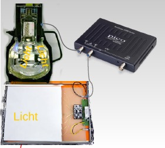

# Software zur Auslese und Analyse der Experimente des Netzwerks Teilchenwelt

*Kurzfassung:*  
 Python-Script zur Aufnahme und Auswertung der Daten der CosMO-Detektoren
 und der Kamiokanne des Netzwerks Teilchenwelt mit einem USB-Oszilloskop
 der Firma PicoTechnology

   


Ein ausführliches Tutorium befindet sich unter dem Link [Anleitung.pdf](https://github.com/GuenterQuast/picoCosmo/blob/master/doc/Anleitung.pdf).

## Kurzbeschreibung der Funktionalität

Das Netzwerk Teilchenwelt, <http://www.Teilchenwelt.de> stellt Experimente
zum Nachweis von Myonen aus der kosmischem Strahlung zur Verfügung.
Dies sind die Szintillationszähler des CosMO-Experiments und der aus einer
Kaffeekanne mit aufgesetzter Photoröhre bestehende Wasser-Cherenkov-Zähler
"Kamiokanne". Diese Detektoren liefern kurze Signale von ca. 100 ns Dauer
und einigen 10 bis 100 mV Pulshöhe, die mit einem Oszillographen sichtbar
gemacht werden können. 

Auch Geigerzähler oder Detektoren für Gammastrahlung, wie der GDK 101
mit PIN-Dioden können mit dieser Software verwendet werden. 

Moderne USB-Oszilloskope wie das PicoScope der Firma PichoTechnology,
siehe <http://www.picotech.com>, erlauben es, die Pulsformen nicht nur
anzuzeigen, sondern auch in Echtzeit an einen Commputer zu exportieren, mit
dem sie dann aufgezeichnet, angezeigt und analysiert werden können.
Diesem Zweck dient das hier beschriebene Projekt "*picoCosmo*". Es ist auf
Linux-Systemen und auch auf dem Raspberry Pi lauffähig und unterstützt
PicoScope-Geräte mit zwei oder vier Kanälen.

*picoCosmo* nutzt zur Datenaufname den Puffermanager und die Echtzeit-Anzeigen
des Projekts *picoDAQ* (<https://github.com/Guenter.Quast/picoDAQ>).
Der Puffermanager von *picoDAQ* sammelt die Daten und verteilt sie an
Echtzeit-Anzeigen oder weitere Prozesse zur Datenauswertung.
*picoCosmo* ist eine angepasste und um umfangreiche Funktionalität zur
Datenauswertung erweiterte Variante des Scripts *runDAQ.py* aus dem Projekt
*picoDAQ*.

Die Analyse der aufgezeichneten Pulsformen verläuft in drei Schritten:

1. #### Validierung der Trigger-Schwelle des Oszilloskops
   Dazu wird der Signalverlauf um den Triggerzeitpunkt mit einem
   Musterpuls verglichen und das Signal akzeptiert, wenn die Form gut
   übereinstimmt und der Puls eine Mindesthöhe überschreitet.

2. #### Suche nach Koinzidenzen
   Als nächstes werden Pulse auf allen aktiven Kanälen in der Nähe
   des Triggerzeitpunkts gesucht. Bei mehr als einem
   angeschlossenen Detektor wird ein aufgezeichnetes Ereignis
   akzeptiert, wenn mindestens zwei in zeitlicher Koinzidenz
   auftreten.

3. #### Suche nach verzögerten Pulsen
   Im optionalen dritten Schritt werden weitere Pulse auf allen
   aktiven Kanälen gesucht und die Zeitdifferenz zum
   Triggerzeitpunkt festgehalten. Solche Pulse treten auf,
   wenn ein Myon aus der kosmischen Strahlung nach Durchgang
   durch den bzw. die Detektoren gestoppt und das aus dem Zerfall
   entstandene Elektron registriert wird. Die registrierten
   individuellen Lebensdauern folgen einer Exponential-Verteilung mit
   einer mittleren Lebensdauern von 2,2 µs, die auf diese Weise
   bestimmt werden kann.

Die Software bietet Echtzeit-Anzeigen der Myon-Rate, der aufgenommenen
Pulshöhen und der Myon-Lebensdauern. Zusätzlich können Mehrfach-Pulse
als Rohdaten der registrierten Pulsformen oder als Bilder im *.png*-Format
gespeichert werden.


###Abhängigkeiten von anderen Paketen

Der hier bereit gestellte Code hängt von anderen Software-Paketen
ab, die zuvor auf Ihrem System installiert sein müssen:

  - das Datennahme-Paket ('Data Acquisition') *picoDAQ*,
    <https://github.com/GuenterQuast/picoDAQ>
  - das *pyhton* -Interface *pico-python*,
    <https://github.com/colinoflynn/pico-python>
  - die Gerätetreibern und C-Bibliotheken aus dem
      'Pico Technlology Software Development Kit', das zusammen mit

    der PicoScope-Software installiert wird, siehe
    <https://www.picotech.com/downloads>

  Auch auf dem Raspberry Pi können die Treiber installiert werden,
  die grafische Oberfläche *PicoScope* ist allerdings (noch) 
  nicht verfügbar.

##Installation der Software

Zunächst werden alle Dateien dieses Projekts über den Link
<https://github.com/GuenterQuast/picoCosmo> herunter geladen
und in einem Arbeitsverzeichnis abgelegt. Vor der Verwendung
müssen die folgenden Pakete installiert werden: 

  - PicoTech Software Development Kit:  
    <https://www.picotech.com/library/oscilloscopes/picoscope-software-development-kit-sdk>.
  - das *pico-pyhton* Paket:  
    <https://github.com/colinoflynn/pico-python>.
  - das picoDAQ Paket, vers. >= 0.7.2:  
    <https://github.com/GuenterQuast/picoDAQ>. 


Zur Vereinfachung der Installation sind im Unterverzeichnis *libs/whl/* kompatible
Versionen der Module *picoscope* aus dem Paket *pico-python*
und *picodaqa* aus dem Paket *picoDAQ* als *python-wheels*
enthalten; die Dateien für das picoscope 
    pip install *.whl 
installiert werden können. 

Die Treiberdateien der Firma *PicoTech* für den **Raspberry Pi**
sind im Verzeichnis *libs/picoscopelibs/* enthalten. Durch Ausführen
des Scripts *installlibs.ls* werden alle für *picoCosmo* notwendigen
Komponenten auf der Rasbperry Pi installiert.


## Programmausführung

Der Code kann entweder auf der Linux-Kommandozeile über das
Script *runCosmo.py* oder über eine grafische Oberfläche,
*CosmoGui.py*, gestartet werden.

Um die grafische Öberfläche zu nutzen, wird das Verzeichnis *picoCosmo*
benötigt:

     cd 
     mkdir picoCosmo

Jetzt wird die Oberfläche mit dem Befehl 

    <picoCosmo-Installationsverzeichnis>/CosmoGui.py

Als Alternative zur grafischen Oberfläche kann *picoCosmo* auch über die 
Kommandozeile gestartet werden. Dazu ins Installationsverzeichnis von *picoCosmo* 
wechseln

    cd  <picoCosmo-Installationsverzeichnis>

und dann  

    ./runCosmo.py [Konfigurationsdatei]
eingeben.

Die benötigten Information zur Konfiguration des USB-Oszilloskops,
der Pufferverwaltung zur Bereitstellung der Daten und die Pulsanalyse
werden in Konfigurationsdateien im *.yaml*-Format bereit gestellt.
Die für eine spezielle Konfiguration verwendeten Dateien sind in
einer Datei im *.yaml*-Format mit der Endung *.daq* enthalten.

Beide Programme benötigen eine Konfigurationsdatei

  - *Cosmo.daq* : Konfiguration für die Cosmo-Panels
  - *Kanne.daq* : Konfiguration für die  Kamiokanne.

Diese Dateien enthalten die Namen weiterer Konfigurationsdateien, die für das
PicoScope, den Puffer-Manager und die Pulsanalyse verwendet werden.

Auch die grafische Oberfläche kann analog mit einer Konfiguration
initialisiert werden:

    ./CosmoGui xxx.daq

Die Konfigurationsdatei kann aber auch mittels der grafischen Oberfläche
ausgewählt und die spezifizierten Konfigurationen editiert werden.
Über die grafische Oberfläche kann ein Arbeitsverzeichnis für die
Ausgabedateien und ein Name für die Datennahme festgelegt werden.
Alle für eine Datennahme (einen sogenannten *Run*) benötigten
Konfigurationsdateien und die Programmausgaben werden in einem
eigenen Verzeichnis abgelegt, deren Name aus dem Namen für die
Datennahme und dem Startzeitpunkt abgeleitet wird.


## Details zu Konfiguration

Wie oben beschrieben, wir die Datanaufnahme und Analyse entweder
über die grafische Oberfläche (*./CosmoGui.py xxx.daq*) oder
über die Kommandozeile (*./runCosmo xxxx.daq* gestartet.
Ohne Angabe einer Konfigurationsdatei wird die Datei *default.daq* 
verwendet. 

Nach dem Start eines Runs startet die grafische Oberfläche des Puffer-Managers
und die in der Konfiguration festgelegten Echtzeit-Anzeigen. Über die
Kontrollflächen des Puffer-Managers kann die Datennahme pausiert (*Pause*),
wieder aufgenommen (*Resume*) oder beendet werden (*Stop* und **EndRun*).
In gestopptem Zustand werden die Ausgabedateien geschlossen, aber alle Fenster
bleiben noch geöffnet, so dass Grafiken betrachtet oder gespeichert und
statistische Information ausgewertet werden können. Wird der Run beendet,
verschwinden alle Fenster.

Zwei Hilfsanwendungen, *plotDoublePulses.py* und *makeFigs.py* ermöglichen
das Einlesen der abgespeicherten Pulsformen und deren graphische Anzeige
bzw. Abspeichern als Grafikdateien im *.png*-Format.

Die Konfigurationsdateien für das USB-Oszilloskop, den Puffer-Manager und
die Signalanalyse sind in jeweils einer  Datei vom  Typ *.yaml* im
Unterverzeichnis *./config/* festgelegt. Die Dateinamen sind in Dateien vom
Typ *.daq* enthalten, also `Kanne.daq` für Kamiokanne and *Cosmo.daq* für
die CosMO-Panels.

Die folgenden Beispiele gelten für den Kamiokanne-Detektor. Generell entspricht
die in den Konfigurationsdateien verwendete Syntax der Markup-Sprache *yaml*.
Insbesondere kennzeichnet Text nach einem `#` -Zeichen erklärende Kommentare 
oder enthält alternative, auskommentierte Konfigurationsoptionen, die durch
Löschen des `#` -Zeichens aktiviert werden können.

**Inhalt der Datei Kanne.daq:**

    # file Kanne.daq
    # --------------------
    # Konfigurationsdateien für den Kamiokanne-Detektor
    
    DeviceFile: config/PMpulse.yaml   # Konfiguration des Oszilloskops
    BMfile:     config/BMconfig.yaml  # Konfiguration des Puffer-Managers
    PFfile:     config/PFconfig.yaml  # Konfiguration des Pulsfilters

Die  Oszilloskop-Konfiguration enthält Informationen zum Typ des Oszilloskops, 
die aktiven Kanäle und zum Trigger.

**Inhalt der Datei PMpulse.yaml:**

    # file PMpulse.yaml
    # -----------------
    # Konfigurationsdatei für PicoScope an Photoroehre
    
    PSmodel: 2000a      # Modeltyp (2000a ist voreingestellt)
    
    picoChannels:      [A]         # aktiver Kanal, [A,B] aktiviert beide Kanaele
    ChanRanges:        [0.5, 0.2]  # Messbereich
    ChanOffsets:       [0.4, 0.45] # analoger Offset, der vor Anzeige addiert wird.
    
    sampleTime:   16.E-6 #  Zeitdauer einer einzelnen Datenaufnahme
         # Zahl im wissenschaftlichen Format mit '.' und Exponent mit Vorzeichen
    Nsamples:     3500   # Anzahl der aufzunehmenden Messpunkte 
    
    trgChan:    A        # Kanal, auf den der Trigger wirkt
    trgThr:     -45.E-3  # Schwelle
    trgTyp:     Falling  # fallend (Falling) oder ansteigend (Rising)
    trgTO:      5000     # Timeout, nach dieser Zeit wird einmal ausgelesen
    pretrig:    0.05     # Anteil der vor dem Trigger ausgelesenen Daten
    ChanColors: [darkblue, sienna, indigo] # Farben für Darstellung der Kanäle

Die Datei für den Puffer-Manager gibt an, wie viele Puffer verwendet
werden, welche Anzeige-Module gestartet werden und ob ein Log-File
erstellt werden soll:

**Inhalt der Datei BMconfig.yaml:**

    # file BMconfig.yaml
    # ------------------
    # Konfigurationsdatei des picoDAQ Puffermanagers
    
    NBuffers: 16         # Anzahl der Puffer für aufgezeichnete Pulsformen
    BMmodules: [mpOsci]  # BufferMan- Module, die gestartet werden sollen
    verbose: 1           # setze Niveau der ausgegebenen Nachrichten (0, 1, 2) 
    LogFile: BMsum       # Schreibe log-Datei mit laufenden Angaben 

Die Konfiguration der Pulsanalyse spezifiziert die gewünschten
Ausgabedateien und gibt  die Pulsform und die Pulshöhe
für jeden Kanal sowie die zu startenden Anzeige-Module an.
Sie enthält auch die Spezifikation der Echtzeit-Histogramme für
Pulshöhen, Myon-Rate und Lebensdauer. Ein Beispiel ist hier gezeigt:

**Inhalt der Datei PMconfig.yaml:**

    # file PFKanne.yaml
    # -------------------
    # Konfigurationsdtei für den PulseFilter mit Kamiokanne
    
    #logFile: pFilt     # speichere Angaben zu allen gefundenen Pulsen
    logFile: Null      #     Null falls keine Ausgebe erwuenscht
    logFile2: dpFilt   # speichere nur  Doppelpulse, Null falls nicht erwuenscht
    rawFile:  rawDP    # speichere Rohdaten von Doppelpulsen, put Null if not wanted
    pictFile: pictDP   # Speichere Bilder von Doppelpulsen
    
    # Puls-Parameter
    #         ______
    #        /      \ 
    #     _ /_ _ _ _ \_ 
    #      r    on  f 
    #  r = rise (Anstiegszeit), on (Haltezeit), f = falling (Abfallzeit)
    
    # Pulsformen für die aktiven Kanaele
       #      falls nur eine angegeben, gilt sie fuer all Kanaele
    pulseShape:
     - pheight: -0.035   # Pulshoehe
       taur   : 20.E-9   # Anstiegszeit
       tauon  : 12.E-9   # Haltezeit
       tauf   : 128.E-9  # Abfallzeit
    
    # Pulsform fuer Triggerpuls
    #         optional - falls nicht angegeben, nutze pulseShape
    trgPulseShape:
     - pheight: -0.045   # Pulshoehe
       taur   : 20.E-9   # Anstiegszeit
       tauon  : 12.E-9   # Haltezeit
       tauf   : 128.E-9  # Abfallzeit


    # Anzeigen, die gestartet werden sollen
    modules: [RMeter, Display, Hists]  # Rate, Pulsform, Histogramme
    
    # Definition der Histogramme
    histograms:
     # min  max Nbins ymax    title              lin/log
     - [0., 0.4, 50, 20., "noise Trg. Pulse (V)", 0]
     - [0., 0.8, 50, 15., "valid Trg. Pulse (V)", 0]
     - [0., 15.,  45, 7.5, "Tau (µs)", 1]
     - [0., 0.8, 50, 15., "Pulse Height (V)", 0]
    
    doublePulse: True  # Doppelpulssuche ein, False falls nicht erwuenscht


## Beispielausgabe

Das Verzeichnis *./output* enthält Ergebnisse einer Langzeitmessung
(ca. 20 Tage) mit der Kanne und einer etwa eintägigen Messung mit
zwei Cosmo-Panels. 

Die gepackte Datei *rawDP_<date>.dat.zip* enthält die Rohdaten der
aufgezeichneten Pulsformen für erkannte Doppelpulse. Die Scripte
*plotDoublePulses.py* und *makeFigs.py* erlaubt das Einlesen der
gepackten Datei und die grafische Darstellung der Doppelpulse bzw.
die Speicherung als Grafikdateien im *.png*-Format. Die aus den
Doppelpulsen bestimmten Lebensdauern sind in der Datei
*dpKanne2_180403.dat* enthalten. Eine Anpassung einer Exponentialfunktion
an gemessene Lebensdauern zwischen 1.5 µs and 15. µs kann mit dem Skript
*fit_dpData.py* ausgeführt werden; das Ergebnis zeigt die Grafikdatei
*life-ofMU_180403.png*.

## Ausführen auf dem  Raspberry Pi

*picoCosmo* läuft auch auf dem Einplatinen-Computer Rasbperry Pi unter
dem Betriebssystem Raspbian. Nach dem Aufsetzen des Raspberry Pi sind
die folgenden Schritte notwendig  um alle benötigten Pakete zu installieren (*stretch* Release):

```bash
sudo apt-get update
sudo apt-get upgrade

sudo apt-get install python3-scipy
sudo apt-get install python3-matplotlib
sudo apt-get install python3-pyqt5
sudo apt-get install libatlas-base-dev # needed by latest version of numpy

sudo pip3 install pyyaml

# Installation der MS TrueType fonts
sudo apt-get install ttf-mscorefonts-installer

# Installation der picoScope-Treiber siehe
#    https://www.picotech.com/support/topic14649.html
# nach Aufsetzen des picotech Repositories
sudo apt-get install libps2000a
sudo apt-get install libps2000

# picoCosmo Code und notwendige Pakete
mkdir git
cd git
git pull https://github.com/GuenterQuast/picoCosmo
cd picoCosmo/whl
sudo pip3 install *.whl
# Nuter in Gruppe  pico eintragen, um Zugriff auf USB-Ports zu gewähren 
sudo useradd -G pico $USER
```

Erzeugen Sie das Unterverzeichnis *picoCosmo*, in dem alle Konfigurationsdateien und  
die Programmausgabe gespeichert werden: 

     cd 
     mkdir picoCosmo

Jetzt ist alles vorbereitet, um die grafische Oberfläche von *picoCosmo* zu starten:

    <picoCosmo-Installationsverzeichnis>/CosmoGui.py   