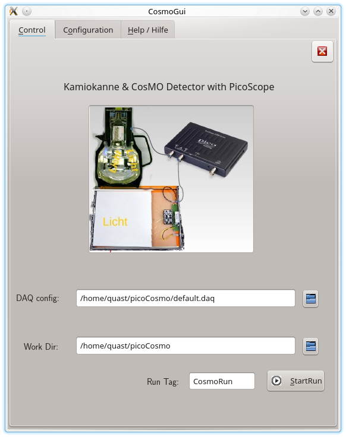
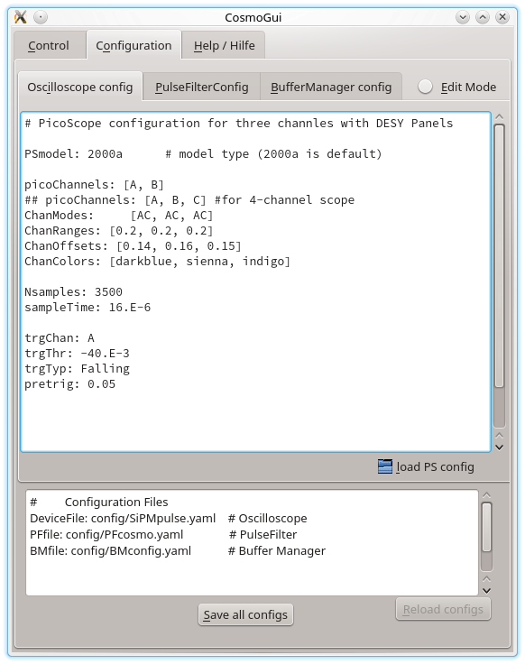
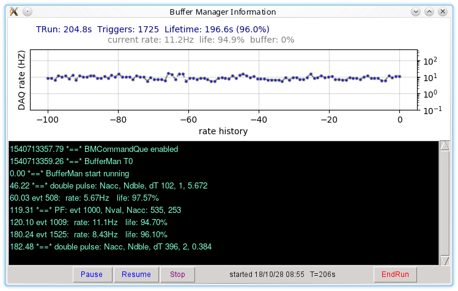
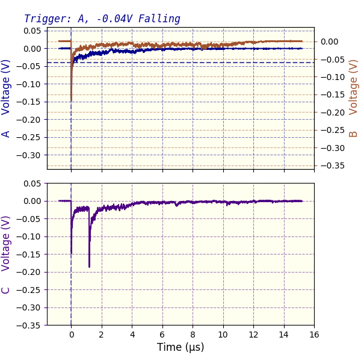
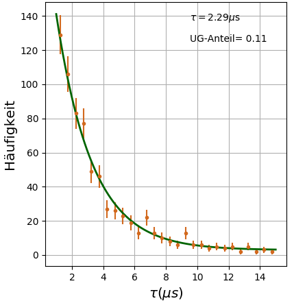

# Software zur Auslese und Analyse der Experimente des Netzwerks Teilchenwelt

*Kurzfassung:*  
 Die in diesem Projekt bereit gestellten *python*-Skripte diene zur Aufnahme und Auswertung der Daten der CosMO-Detektoren und der Kamiokanne des Netzwerks Teilchenwelt mit einem USB-Oszilloskop.

   


## Übersicht 

Das Netzwerk Teilchenwelt, <http://www.Teilchenwelt.de> stellt Experimente
zum Nachweis von Myonen aus der kosmischem Strahlung zur Verfügung.
Dies sind die Szintillationszähler des CosMO-Experiments und der aus einer
Kaffeekanne mit aufgesetzter Photoröhre bestehende Wasser-Cherenkov-Zähler
"Kamiokanne".  Typisch für diese und ähnliche Detektoren sind kurze Signalpulse
von ca. 100 ns Dauer und einigen 10 bis 100 mV Pulshöhe, die zu zufälligen
Zeitpunkten entstehen. Die Zeitdifferenzen zwischen zwei solchen Zufallsereignissen
folgen einer Exponentialverteilung, deren Zeitkonstante dem Kehrwert der mittleren
Ereignisrate entspricht. Mit einem Oszilloskop mit hinreichend hoher Bandbreite
können die Signalpulse angezeigt werden. Wegen der zufälligen Natur der Signale
ist dabei eine geeignete  Einstellung des Oszilloskop-Triggers wichtig.

Moderne, am  USB-Port eines Rechners betriebene Oszilloskope wie das
PicoScope der Firma PichoTechnology, siehe <http://www.picotech.com>,
erlauben es, die Signalformen nicht nur anzuzeigen, sondern auch in Echtzeit
an einen Computer zu exportieren, mit dem sie dann aufgezeichnet, 
angezeigt und analysiert werden können.
Diesem Zweck dient das hier beschriebene Projekt "*picoCosmo*". Es ist auf
Linux-Systemen und auch auf dem Raspberry Pi lauffähig und unterstützt
PicoScope-Geräte mit zwei oder vier Kanälen.

*picoCosmo* nutzt zur Datenaufname den Puffermanager und die Echtzeit-Anzeigen
des Projekts *picoDAQ* (<https://github.com/Guenter.Quast/picoDAQ>).
Der Puffermanager von *picoDAQ* registriert die Daten des Oszilloskops, speichert
sie in einem Zwischenspeicher, dem Puffer, und verteilt sie von dort an mehrere
sog. Konsumenten wie Echtzeit-Anzeigen oder weitere Prozesse zur Datenauswertung.

*picoCosmo* ist eine angepasste und um umfangreiche Funktionalität zur
Datenauswertung erweiterte Variante des Scripts *runDAQ.py* aus dem Projekt
*picoDAQ*.

Die Analyse der vom Oszilloskop-Trigger ausgewählten und danach aufgezeichneten
Pulsformen wird im sog. PulsFilter durchgeführt und verläuft in drei Schritten:

1. #### Validierung der Trigger-Schwelle des Oszilloskops
   Der Signalverlauf um den Triggerzeitpunkt wird mit einem
   Musterpuls verglichen und das Signal akzeptiert, wenn die Form gut
   übereinstimmt und der Puls eine Mindesthöhe überschreitet.

2. #### Suche nach Koinzidenzen
   Als nächstes werden Pulse auf allen aktiven Kanälen in der Nähe
   des Triggerzeitpunkts gesucht. Bei mehr als einem
   angeschlossenen Detektor wird ein aufgezeichnetes Ereignis
   akzeptiert, wenn mindestens zwei in zeitlicher Koinzidenz
   auftreten.

3. #### Suche nach verzögerten Pulsen
   Im optionalen dritten Schritt werden weitere Pulse auf allen
   aktiven Kanälen gesucht und die Zeitdifferenz zum
   Triggerzeitpunkt festgehalten. Solche Pulse treten auf,
   wenn ein Myon aus der kosmischen Strahlung nach Durchgang
   durch den bzw. die Detektoren gestoppt und das aus dem Zerfall
   entstandene Elektron registriert wird. Die registrierten
   individuellen Lebensdauern folgen einer Exponential-Verteilung mit
   einer mittleren Lebensdauer von 2,2µs, die auf diese Weise
   bestimmt werden kann. Natürlich treten auch Zufallskoinzidenzen
   auf, wenn ein zweites Myon oder ein Rausch-Pulse sehr kurz nach
   dem Myon eintrifft, das den Trigger ausgelöst hat. 

Die Software bietet Echtzeit-Anzeigen der Myon-Rate, der aufgenommenen
Pulshöhen und der Myon-Lebensdauern. Die in Echtzeit bestimmten Signal-Parameter
werden optional kontinuierlich in Dateien geschrieben. Zusätzlich können
Mehrfach-Pulse als Rohdaten der registrierten Pulsformen oder als Bilder im
 *.png*-Format gespeichert werden.

Details zu Abhängigkeiten und zur Installation von *picoCosmo* finden sich in der
Datei  [README_de.md](../README_de.md).


## Starten des Programms

Nach dem Anschließen des PicoScopes an den USB-Port kann das Programm gestartet
werden. Dies kann entweder auf der Linux-Kommandozeile über das Script *runCosmo.py*, 
am einfachsten aber über die grafische Oberfläche, *CosmoGui.py*, erfolgen. Die grafische
Oberfläche kann auch mit einem *Icon* verknüpft werden, so dass das Programm durch
einfaches Anklicken gestartet werden kann. 

Die grafische Oberfläche erlaubt das Festlegen und Bearbeiten der Konfiguration und des Arbeitsverzeichnisses, in dem Dateien abgelegt werden, sowie den Start der eigentlichen
Datenaufnahme. Hier ein Bild des Begrüßungsbildschirms der grafischen Oberfläche:

   

In den Feldern mit Dateinamen steht zunächst die Haupt-Konfigurationsdatei, in der alle weiteren Konfigurationsdateien enthalten sind, sowie das Arbeitsverzeichnis, in dem modifizierte Konfigurationen und die aufgezeichneten Daten abgelegt werden. Im Feld *Run Tag* steht ein Name, der der aktuellen Messung zugeordnet ist und aus dem die Dateinamen für Konfigurations- und Ausgabedateien abgeleitet werden.  

Bei Klick auf den Reiter *Configuration* öffnet sich die Anzeige der aktuellen Konfigurationsdateien:

   


Ganz unten im Fenster wird die Hauptkonfiguration angezeigt, die lediglich die Namen der Konfigurationsdateien für das USB-Oszilloskops, die Pulsanalyse und die Datennahme enthält.  Die Reiter *Oscilloscope*, *PulseFilter* und *BuferManager* zeigen die einzelnen Konfigurationsdateien an.  Die Konfigurationsdateien können mittels der grafischen Oberfläche ausgewählt (Klick auf das Dateisymbol) oder verändert werden (Knopf *EditMode* aktivieren). Details zu den einzelnen Konfigurationen werden
weiter unter erklärt. 

Wenn alle Konfigurationsdateien erstellt sind, können sie mit dem Feld `Save all configs` im Arbeitsverzeichnis unter den in der Hauptkonfiguration angegebenen Namen gespeichert werden. Der Name der Hauptkonfigurationsdatei ist dabei der im Feld `Run Tag` gesetzte Text mit der Erweiterung *.daq*.  Vor dem Abspeichern erfolgt eine Überprüfung auf syntaktische Richtigkeit - sollte eine Fehlermeldung angezeigt werden, kann die betroffene Datei korrigiert und dann die gesamte Konfiguration abgespeichert werden. 

Das Starten der Datennahme erfolgt mit dem Knopf `Start Run` im Begrüßungsbildschirm. Im gewählten Arbeitsverzeichnis wird eigenes Unterverzeichnis erzeugt, dessen Name aus dem im Feld `Run Tag` eingetragenen Text und dem aktuelle Datum abgeleitet wird. Auch die komplette Konfiguration wird dort abgespeichert, so dass jederzeit ersichtlich ist, unter welchen Bedingungen die Daten im Verzeichnis aufgenommen wurden. Danach beendet sich die grafische Oberfläche, und die eigentliche Datennahme (engl. "Run") beginnt mit dem  Start der grafischen Oberfläche des Puffer-Managers und den in dessen Konfiguration festgelegten Echtzeitanzeigen. Die grafische Oberfläche ist hier gezeigt:

   


Über die Kontrollflächen des Puffer-Managers kann die Datennahme pausiert (*Pause*),  wieder aufgenommen (*Resume*) oder beendet werden (*Stop* und *EndRun*). In gestopptem Zustand werden die Ausgabedateien geschlossen, aber alle Fenster bleiben noch geöffnet, so dass Grafiken betrachtet oder gespeichert und statistische Information ausgewertet werden können. Wird der Run beendet, verschwinden alle Fenster.

Das Programm wird in einem Konsolenfenster ausgeführt, in dem vielfältige Informationen zur Initialisierung, Konfiguration und zum Start einzelner, jeweils als Hintergrundprozesse ausgeführten Programmkomponenten angezeigt werden. Die Kontrolle ist auch über Eingabe einzelner Kommandos mit der Tastatur möglich, wenn das Ausgabefenster vorher durch Anklicken aktiviert wurde: 

    type -> E(nd), P(ause), S(top) or R(esume) + <ret> 


Als einer der Datenkonsumenten des Puffermanagers startet neben den diversen Echtzeitanzeigen auch der Pulsfilter zur Analyse der vom  Oszilloskop ausgelesenen Daten mit den in dessen Konfiguration festgelegten Echtzeit-Anzeigen. 

Informationen über die im Pulsfilter erkannten Signale werden laufend in Dateien auf der Festplatte abgelegt:

  - Dateien mit dem Namensanfang  *pFilt* enthalten Informationen zu
    allen aufgezeichneten Pulsen, die die Stufe der Triggervalidierung
    passiert haben. 

  - Dateien mit dem Namensanfang *dpFilt* enthalten Informationen zu den
    aufgezeichneten Doppelpulsen im CSV-Format:

     ```Nacc,      Ndble,      Tau,     delT(iChan), ... , V(iChan), ...``` 

    - *Nacc*  : Zahl der akzeptierten Pulse
    - *Ndble*: Zahl der akzeptierten Doppelpulse 
    - *Tau*:   Zeitlicher Abstand zwischen Triggerpuls und (erstem) Folgepuls
       (= gemessene µ-Lebensdauer)
    - *delT(iChan)* :  zeitlicher Abstand des Doppelpulses vom Triggerpuls in
       Kanal *iChan*
    - *V(iChan)*: Pulshöhe in mV des Folgepulses in Kanal *iChan*

 - Falls eingeschaltet, werden auch die vollständigen Rohdaten von allen
   erkannten Doppelpulsen in der Dateien mit Namensbeginn *dpRaw* im
   *.yaml*-Format abgelegt. Damit können eigene Analysen der Rohdaten
    ausgeführt werden. 

Es ist auch möglich, grafische Darstellungen von Doppelpulsen im Verzeichnis mit 
Namensbeginn *dpFig* abzulegen. Ein Beispiel für einen Doppelpuls im untersten von
drei Cosmo-Panels ist hier gezeigt: 

   

Zwei Hilfsanwendungen, *plotDoublePulses.py* und *makeFigs.py* ermöglichen das Einlesen der abgespeicherten Pulsformen und deren grafische Anzeige bzw. Abspeichern als Grafikdateien
im *.png*-Format.

Eine weitere Hilfsanwendung, *fit_dpData.py*, fürhrt die Anpassung einer Exponentialfunktion an
die in Dateien mit Namensanfang *dpFilt* abgelegten individuellen µ-Lebensdauern. Zum Start
einer Anpassung an die in der Datei dpFilt<Name>.dat abgelegten Daten im Bereich von
1.0 bis 15 µs folgenden Befehl auf der Kommandozeile eingeben:

    ./fit_dpData.py dpFilt<Name> 1.0 15.

Ein typisches Ergebnis mit etwa 700 mit den Cosmo-Panels aufgezeichneten Doppelpulsen im Bereich von 1µs - 15µs ist hier gezeigt:

 


## Details zu Konfiguration

Die Konfigurationsdateien für das USB-Oszilloskop, den Puffer-Manager und die Signalanalyse sind in jeweils einer  Datei vom  Typ *.yaml* im Unterverzeichnis *config/* festgelegt. Die Dateinamen sind in Dateien vom Typ *.daq* enthalten, also `Kanne.daq` für Kamiokanne und *Cosmo.daq* für die CosMO-Panels. Sie können entweder mit einem Text-Editor oder auch mit Hilfe der oben beschriebenen grafischen Oberfläche bearbeitet werden.

Die folgenden Beispiele gelten für den Kamiokanne-Detektor. Generell entspricht die in den Konfigurationsdateien verwendete Syntax der Markup-Sprache *yaml*. Insbesondere kennzeichnet
Text nach einem `#` -Zeichen erklärende Kommentare oder enthält alternative, auskommentierte Konfigurationsoptionen, die durch Löschen des `#` -Zeichens aktiviert werden können. 


Diese folgende Datei enthält die Dateinamen der einzelnen Konfigurationsdateien:

**Inhalt der Datei Kanne.daq:**

    # file Kanne.daq
    # --------------------
    # Konfigurationsdateien für den Kamiokanne-Detektor
    
    DeviceFile: config/PMpulse.yaml   # Konfiguration des Oszilloskops
    BMfile:     config/BMconfig.yaml  # Konfiguration des Puffer-Managers
    PFfile:     config/PFconfig.yaml  # Konfiguration des Pulsfilters


**Konfiguration des Oszilloskops**

Die  Oszilloskop-Konfiguration enthält Informationen zum Typ des Oszilloskops,  die aktiven Kanäle und zum Trigger. Bei den Einstellungen zum Messbereich kann ein analoger Offset eingestellt werden, der zum Signal addiert wird. Bei unipolaren Pulsen, wie sie viele Detektoren produzieren, kann so eine Erhöhung der Auflösung sowie eine optimierte Darstellung erreicht werden.  Wenn nur ein Kanal aktiv ist, werden Angaben für die weiteren Kanäle ignoriert.   
Die Einstellungen zur Zeitbasis des Oszilloskops erlauben die Angabe der gesamten, aufzuzeichnenden Zeitdauer und die Anzahl der Messwerte - die Differenz zwischen zwei Abtastungen ergibt sich dann als Quotient dieser Werte. Die Einstellungen zum Trigger erlauben die Auswahl des Triggerkanals, die Triggerschwelle und die Richtung des Signals - also steigend (*Rising*) oder fallend (*Falling*). Es ist auch möglich, die Signalausgabe vor dem eigentlichen Triggerzeitpunkt zu starten - dazu dient der Eintrag *pretrig*, der den prozentualen Anteil der vor dem Triggerzeitpunkt ausgegebenen Werte angibt.  
Es ist an dieser Stelle wichtig anzumerken, dass die vorgegebenen Werte nicht unbedingt denen entsprechen, die vom Oszilloskop unterstützt werden. Bei der Initialisierung werden die vorgegebenen Werte durch solche ersetzt, die unterstützt werden und den Vorgaben am nächsten kommen. Die tatsächlich eingestellten Werte werden nach Initialisierung des Oszilloskops in der Textkonsole angezeigt.

Ein typisches Beispiel einer Konfigurationsdatei für einen Kanal und den Betrieb an einer Photoröhre ist hier gezeigt (Datei PMpulse.yaml) :

    # file PMpulse.yaml
    # -----------------
    # Konfigurationsdatei für PicoScope an Photoroehre
    
    PSmodel: 2000a      # Modeltyp (2000a ist voreingestellt)
    
    picoChannels:      [A]         # aktiver Kanal, [A,B] aktiviert beide Kanaele
    ChanRanges:        [0.5, 0.2]  # Messbereich
    ChanOffsets:       [0.4, 0.45] # analoger Offset, der vor Anzeige addiert wird.
    
    sampleTime:   16.E-6 # Zeit zwischen zwei Messpunkten in s
         # Zahl im wissenschaftlichen Format mit '.' und Exponent mit Vorzeichen
    Nsamples:     3500   # Anzahl der aufzunehmenden Messpunkte 
    
    trgChan:    A        # Kanal, auf den der Trigger wirkt
    trgThr:     -45.E-3  # Schwelle
    trgTyp:     Falling  # fallend (Falling) oder ansteigend (Rising)
    trgTO:      5000     # Timeout, nach dieser Zeit wird einmal ausgelesen
    pretrig:    0.05     # Anteil der vor dem Trigger ausgelesenen Daten
    ChanColors: [darkblue, sienna, indigo] # Farben für Darstellung der Kanäle


**Konfiguration des Pulsfilters**

Die Konfiguration der Pulsanalyse spezifiziert die gewünschten Ausgabedateien und gibt  die Pulsform und die Pulshöhe für jeden Kanal sowie die zu startenden Anzeige-Module an. Im ersten Teil des unten gezeigten Beispiels werden die gewünschten Ausgabedateien angegeben, also die Ausgabe aller Pulsparamter nach der Validierung der Triggerbedingung, die Pulsparameter oder die kompletten Rohdaten der Signalformen für gefundene Doppelpulsen oder auch die Abspeicherung der Signalformen als Grafiken.  
Im zweiten Teil der Datei werden die Pulsparameter für die Pulssuche angegeben, und zwar für die Näherung als Trapezförmiges Signal mit Anstiegszeit (*taur*), Haltezeit (*tauon*) und Abfalleit (*tauf*) sowie der Pulshöhe am Maximum (*pheight*) als Parameter. Ein solcher Eintrag kann für jeden aktiven Kanal angegeben werden; wird nur einer angegeben, gilt er für alle Kanäle.   
Oft ist es notwendig, für den Triggerpuls andere
Pulsparameter auszuwählen. Dazu kann optional mit dem Schlüsselwort *trgPulseShape* eine eigene Pulsdefinition für den Triggerpuls auf dem Triggerkanal gewählt werden.  
Über das Schlüsselwort *modules* werden die gewünschten Echtzeit-Anzeigen angegeben. Möglich sind eine Darstellung der Rate akzeptierter Ereignisse in Abhängigkeit von der Zeit, eine einfache Anzeige der Signalhöhen für jedes akzeptierte Ereignis als Balkendiagramm und die Anzeige von Häufigkeitsverteilungen (Histogramme) von Pulsparametern . Die Konfigurationsparameter der gewünschten Histogramme werden im letzten Teil der Datei angegeben. Dies sind der Wertebereich, die Zahl der Intervalle, der Maximalwert der Häufigkeit, ein Name für die angezeigte Größe und die Wahl einer linearen oder logarithmischen Skala. In der gegenwärtigen Version der Software sind nur die vier unten gezeigten Histogramme in genau dieser Reihenfolge implementiert.  
Über den Schlüssel *doublePulse* kann die Doppelpussuche ggf. abgeschaltet werden, wenn man den Wert auf *false* setzt. 

Ein Beispiel für die Analyse von Signalen einer Photoröhre ist hier gezeigt
(Datei BFconfig.yaml):

    # file PFKanne.yaml
    # -------------------
    # Konfigurationsdtei für den PulseFilter mit Kamiokanne
    
    #logFile: pFilt     # speichere Angaben zu allen gefundenen Pulsen
    logFile: Null      #     Null falls keine Ausgebe erwuenscht
    logFile2: dpFilt   # speichere nur  Doppelpulse, Null falls nicht erwuenscht
    rawFile:  rawDP    # speichere Rohdaten von Doppelpulsen, put Null if not wanted
    pictFile: pictDP   # Speichere Bilder von Doppelpulsen
    
    # Puls-Parameter
    #         ______
    #        /      \ 
    #     _ /_ _ _ _ \_ 
    #      r    on  f 
    #  r = rise (Anstiegszeit), on (Haltezeit), f = falling (Abfallzeit)
    
    # Pulsformen für die aktiven Kanaele
       #      falls nur eine angegeben, gilt sie fuer all Kanaele
    pulseShape:
     - pheight: -0.035   # Pulshoehe
       taur   : 20.E-9   # Anstiegszeit
       tauon  : 12.E-9   # Haltezeit
       tauf   : 128.E-9  # Abfallzeit
    
    # Pulsform fuer Triggerpuls
    #         optional - falls nicht angegeben, nutze pulseShape
    trgPulseShape:
     - pheight: -0.045   # Pulshoehe
       taur   : 20.E-9   # Anstiegszeit
       tauon  : 12.E-9   # Haltezeit
       tauf   : 128.E-9  # Abfallzeit


    # Anzeigen, die gestartet werden sollen
    modules: [RMeter, Display, Hists]  # Rate, Pulsform, Histogramme
    
    # Definition der Histogramme
    histograms:
     # min  max Nbins ymax    title              lin/log
     - [0., 0.4, 50, 20., "noise Trg. Pulse (V)", 0]
     - [0., 0.8, 50, 15., "valid Trg. Pulse (V)", 0]
     - [0., 15.,  45, 7.5, "Tau (µs)", 1]
     - [0., 0.8, 50, 15., "Pulse Height (V)", 0]
    
    doublePulse: true  # Doppelpulssuche ein, False falls nicht erwuenscht


**Konfiguration des Puffer-Managers**

Die Konfigurationsdatei für den Puffer-Manager muss meist nicht geändert werden. Sie gibt an, wie viele Puffer verwendet werden, welche Anzeige-Module gestartet werden und ob ein Log-File erstellt werden soll. Hier ein Beispiel (Datei BMconfig.yaml):

```
# file BMconfig.yaml
# ------------------
# Konfigurationsdatei des picoDAQ Puffermanagers

NBuffers: 16         # Anzahl der Puffer für aufgezeichnete Pulsformen
BMmodules: [mpOsci]  # BufferMan- Module, die gestartet werden sollen
verbose: 1           # setze Niveau der ausgegebenen Nachrichten (0, 1, 2) 
LogFile: BMsum       # Schreibe log-Datei mit laufenden Angaben 
```


## Beispielausgabe

Das Verzeichnis *./output* enthält Ergebnisse einer Langzeitmessung
(ca. 20 Tage) mit der Kanne und einer etwa eintägigen Messung mit
zwei Cosmo-Panels. 

Die gepackte Datei *rawDP_<date>.dat.zip* enthält die Rohdaten der
aufgezeichneten Pulsformen für erkannte Doppelpulse. Die Scripte
*plotDoublePulses.py* und *makeFigs.py* erlaubt das Einlesen der
gepackten Datei und die grafische Darstellung der Doppelpulse bzw.
die Speicherung als Grafikdateien im *.png*-Format. Die aus den
Doppelpulsen bestimmten Lebensdauern sind in der Datei
*dpKanne2_180403.dat* enthalten. Eine Anpassung einer Exponentialfunktion
an gemessene Lebensdauern zwischen 1.5 µs and 15. µs kann mit dem Skript
*fit_dpData.py* ausgeführt werden; das Ergebnis zeigt die Grafikdatei
*life-ofMU_180403.png*.


## Didaktische Hinweise

Wichtig für das Verständnis der technischen Grundlagen der Messung der
Eigenschaften der Myonen aus der kosmischen Strahlung ist eine gewisse
Vertrautheit mit der Verwendung von Oszilloskopen, insbesondere die
Notwenigkeit des Triggers und der Speicherfunktion zur Darstellung von
kurzen, zufällig auftretenden Signalen. Zur Einführung kann dazu die
Oszilloskop-Software *Picoscope*  verwendet werden, die mit dem Oszilloskop
auf CD ausgeliefert bzw. heruntergeladen werden kann. Als Download ist
auch die Linux-Version der Software erhältlich.

**Registrierung zufälliger Pulse mit einem Oszilloskop**

Mit einem am Eingang des Oszilloskops angeschlossenen Mikrofon sollten
Schüler zunächst versuchen, das akustische Signal eines kurzen Schallsignals
darzustellen. Dazu müssen Zeitbasis, Messbereich und die Triggerbedingung
entsprechend eingestellt werden.  

**Suche nach Signalen der Myon-Detektoren**

Als zweiten Schritt kann man nun einen der Detektoren zum Nachweis
von Teilchen aus der kosmischen Strahlung anschließen und wieder nach
entsprechenden Pulsen suchen. Wenn Signale dargestellt werden, sollten
die Einstellungen notiert werden, um sie später in die Konfiguration der
der picoCosmo-Software eingeben zu können.

**Koinzidenzen**

Um sicher zu stellen, dass es sich bei den beobachteten Signalen
nicht um Rauschen oder im Sensor selber erzeugte Pulse handelt,
ist eine Koinzidenz-Messung mit zwei Sensoren notwendig. Dazu
kann man zwei gleiche Detektoren oder auch eine Kanne und eines
der CosMO-Panels verwenden. Wenn man auf den einen Kanal triggert
und gleichzeitig beide Kanäle beobachtet, wird man Koinzidenzen sehen,
wenn die Detektoren geometrisch so angeordnet sind, dass sie gleichzeitig
von Spuren durchdrungen werden.  Stellt man die Detektoren nebeneinander
in weiter Entfernung auf, so werden keine Koinzidenzen beobachtet. Mit 
dieser einfachen Vorgehensweise kann also der Nachweis geführt
werden, dass es sich um ein äußeres Phänomen - wie zum Beispiel
den gleichzeitigen Durchgang von Teilchen durch beide Detektoren - 
handeln muss. 

**Ratenmessungen**

Nach diesen Vorversuchen sollten nun mit Hilfe von picoCosmo Messungen
der Koinzidenzrate unter verschiedenen Bedingungen durchgeführt werden.
Dazu sollten mindestens zwei Panels verwendet werden, um Rauschsignale
zu unterdrücken.   Dazu sollte in der Oszilloskop-Konfiguration eine 
Samplingzeit von 1.2 µs mit 250 Samples eingestellt werden. Im Fenster
"RateDisplay" wird nun der zeitliche Verlauf der Koinzidenzrate angezeigt.
Die  Fluktuationen der Rate sind eine Folge der zufälligen Natur der registrierten
Ereignisse - man kann die angezeigte Kurve gut "per Auge" mitteln, um
eine zuverlässige Ratenbestimmung vorzunehmen. Ein genaueres 
Ergebnis erhält man, wenn man die im Textfeld des RateDisplays angezeigte
Anzahl akzeptierter Ereignisse durch die ebenfalls angezeigte Gesamtlaufzeit
dividiert.  Mit diesem experimentellen Set-Up können nun die Eigenschaften
des eben entdeckten Phänomens untersucht werden. Interessant sind
die folgenden Fragen:

- **Aus welcher Richtung kommen die Signale ?**
  dazu werden die Detektoren übereinander, nebeneinander oder
  um 30° und 60° gedreht angeordnet und die gemessenen Raten
  verglichen.  
- **Lassen sich die Signale abschirmen ? **
  Dazu können verschieden dicke Materialien auf einem Tisch
  über den Detektoren angebracht und die jeweiligen Raten gemessen
  werden.
  Eine überzeugende Bestätigung, dass die beobachteten Teilchen
  Materie leicht durchdringen, erhält man, wenn man Messungen
  im Keller mit solchen aus den oberen Stockwerken vergleicht.
  Achtung: wegen der statistischen Natur haben die gemessenen
  Raten eine statistische Unsicherheit, die durch die Poisson-Verteilung
  beschreiben ist. Der Fehler auf die gesamte gemessene Anzahl N ist
  gleich der Wurzel aus N, also ΔN = √N, der relative Fehler auf die Rate
  also ΔN/N = 1/√N .

**Eigenschaften der Detektoren und Effizienz-Korrektur**

Typisch für Messungen, bei denen Signal- und Rauschpulse vorkommen,
ist die Notwendigkeit, einen optimalen Arbeitspunkt festzulegen, an  
dem Signalpulse von Rauschpulsen getrennt werden. Hier ist die kritische Größe die Pulshöhe, die für den Trigger des Oszilloskops
und im Pulsfilter angegeben wird. Ist die Schwelle zu hoch, verliert
man Signalpulse, wenn sie zu niedrig gewählt wird, werden zu viele Rauschpulse akzeptiert.

Die Triggerschwelle des Oszilloskops sollte niedriger als die
Schwelle für den entsprechenden Kanal im Pulsfilter gewählt
werden. Dadurch wird sichergestellt, dass praktisch alle Signale,
die der Pulsfilter akzeptiert, auch den Trigger ausgelöst haben.

Eine quantitative Untersuchung des Signal-zu-Rauschverhältnisses in
Abhängigkeit von der Schwelle wird möglich, wenn man drei Detektoren
zur Verfügung hat. Nutzt man zwei Detektoren in Koinzidenz, so hat man mit sehr hoher Wahrscheinlichkeit einen echten Teilchendurchgang
identifiziert. Jetzt kann man überprüfen, ob auch der dritte Detektor angesprochen hat. Die Ansprechwahrscheinlichkeit ist also die Zahl der Dreifachkoinzidenzen, N_123, dividiert durch die Zahl der Zweifachkoinzidenzen, N_12.

Zur einfachen Auswertung werden im Text-Fenster des BufferManagers
die Zahlen der registrierten Zwei- und Dreifachkoinzidenzen angezeigt.
Auch am Ende der log-Datei, in der die Pulsparameter abgespeichert
werden, findet sich diese Information. 

Wegen des Triggerkanals, der immer ansprechen muss, können
Zeifachkoinzidenzen auf zwei Arten entstehen: 
Panel 2 **oder** Panel 3 hat nicht angesprochen. Dreifachkoinzidenzen werden beobachtet, wenn zusätzlich zum Triggerkanal Panel 2 **und** Panel 3 ansprechen.
Wenn man - vereinfachend - annimmt, dass alle Detektoren in etwa
die gleiche Ansprechwahrscheinlichkeit ε haben, so ergibt sich für
die Anzahlen der Zwei- und Dreifachkoinzidenzen, N_2 bzw. N_3:  

       N_2 = 2·ε·(1-ε) · N 
       N_3 = ε² · N

N ist dabei die Zahl der insgesamt aufgetretenen Myonen, die
Kanal l 1 getriggert haben. Bildet man das Verhältnis von N_2 und N_3, so kann die Ansprechwahrscheinlichkeit bestimmt werden:

 ​     1-ε =  N_2  /  (2 · N_3 + N_2) .  

Die wahre Myon-Rate ergibt sich nun durch Korrektur der gemessenen Koinzidenzraten auf die Ansprechwahrscheinlichkeit.
Verlangt man Koinzidenzen von zwei Panels, so ist die Rauschrate praktisch Null, die Zahl der Myonen ergibt sich also aus der Zahl der Zweifachkoinzidenzen als
  ​    N_µ = N_2 /  ε² 

Bei Verwendung von drei Panels und der Bedingung, das mindestens
zwei davon angesprochen haben, ergibt sich die Zahl der Myonen nach etwas Kombinatorik aus der Zahl der Zweifach- und Dreifachkoinzidenzen zu 

​    N_µ = (N_2 + N_3)  /  (3·ε² - 2·ε³  ) 


**Berücksichtigung der Auslese-Totzeit**

Der Transfer der Daten vom Oszilloskop über die USB-Schnittstelle
benötigt natürlich eine gewisse Zeit, während der keine Signale
aufgezeichnet werden können. Diese sogenannte "Totzeit" zeigt der Buffer Manager im Grafik-Fenster an. Die gesamte aktive Zeit, also   
die Laufzeit verringert um die Totzeit und ggf. Zeiten, die im
*paused*-Zustand verbracht wurden, werden am Ende der Logdateien
ausgegeben. Damit lässt sich direkt die um die Totzeit korrigierte
Rate berechnen: R = N / T_life . N kann dabei die Zahl der akzeptierten Myonen, die Zahl der Zwei- oder Dreifachkoinzidenzen
oder auch die Zahl der Ereignisse mit verzögerten Pulsen sein.

**Messung der Myon-Lebensdauer**


## Liste der Dateien im Projekt *picoCosmo*

  - `CosmoGui.py`

    Grafische Benutzeroberfläche zum Editieren der Konfigurationsdateien  
    und Starten des Skripts `runCosmo.py`

  - `runCosmo.py`  
    Datennahme und Anzeigen wie in den Konfigurationsdateien (Vorgabe
     *defaut.daq* für zwei Cosmo-Panels mit Messung der µ-Lebensdauer

  - `README_de.md` bzw. `README_de.pdf`  
    Deutschsprachige Beschreibung

  - `Anleitung.md` bzw. `Anleitung.pdf`  
    Deutschsprachige Anleitung

## Module
  - picocosmo/PulseFilter.py  
    Analyse der vom Oszillographen gelieferten Pulsformen;  
    Auslese und Anzeige mittels der Module im Projekt *picoDAQ*

## Konfigurationsdateien

  - `default.daq`  
     Konfiguration für zwei Cosmo-Panels

  - `Cosmo.daq`  
     Konfiguration für zwei Cosmo-Panels

  - `Kanne.daq`  
     Konfiguration für eine Kanne mit Photoröhre und Pulslänge 150 ns  


  - `config/BMconfig.yaml`  
    Konfiguration für den Puffermanager

  - `SiPMpulse.yaml'  
    Konfiguration des Picoscopes für SiPM-Pulse 

  - `PMpulse.yaml'  
    Konfiguration des Picoscopes für Photomultiplier-Pulse 

  - `SiPMpulse2000.yaml'  
    Konfiguration eines Picoscopes 2202A für SiPM-Pulse 

  - `PFcosmo.yaml'  
    Konfiguration des PulseFilters für Cosmo-Panels 

  - `PFKanne.yaml'  
    Konfiguration des PulseFilters für eine Kanne

  - `PFcosmo2000.yaml'  
    Konfiguration des PulseFilters für Cosmo-Panels an Picoscope 2202A 

##Beispiele

   - `output/CosmoPanels_180514`  
     Beispielausgabe einer Datennahme mit den Cosmo-Panels  
        - dpFilt_180514_1806.dat enthält die Daten von aufgezeichneten
          Doppelpulsen
        - rawDP_180403.zip enthält gepackte Rohdaten der Doppelpulse  

   - `output/Kanne_180403`  
     Beispielausgabe einer Datennahme mit einer Kanne
        - dpKanne2_180403.dat enthält die Daten von aufgezeichneten
          Doppelpulsen  
        - rawDP_180514.zip enthält gepackte Rohdaten der Doppelpulse  
     
   - `output/fit_dpData.py`  
     *pyhton*-Skript zur Anpassung einer Exponentialfunktion an Daten in Dateien
     *dpFilt*.dat*
     
   - `output/makeFigs.py`  
     Erzeugen von Grafiken aus Dateien *dpRaw*.dat*

   - `output/plotDoublePulses.py`  
     Anzeigen von Doppelpulsen aus Dateien *dpRaw.dat* als Grafiken auf dem
     Bildschirm
