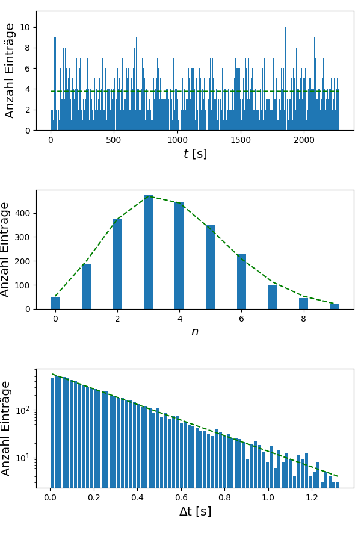

# Tutorial zu picoCosmo

									  Vers. 0.9.0  		                Günter Quast, Sept. 2024

### Auslese und Analyse der Experimente des Netzwerks Teilchenwelt


*Kurzfassung:*  
Die in diesem Projekt bereit gestellten *python*-Skripte dienen zur Aufnahme und Auswertung
von Daten der CosMO-Detektoren und der Kamiokanne des Netzwerks Teilchenwelt mit einem USB-Oszilloskop.

   


## Übersicht 

Das Netzwerk Teilchenwelt (s. <http://www.Teilchenwelt.de> ) stellt Experimente
zum Nachweis von Myonen aus der kosmischem Strahlung zur Verfügung.
Dies sind die Szintillationszähler des CosMO-Experiments und der aus einer
Kaffeekanne mit aufgesetzter Photoröhre bestehende Wasser-Cherenkov-Zähler
"Kamiokanne". Typisch für diese und ähnliche Detektoren sind kurze Signalpulse
von ca. 100 ns Dauer und einigen 10 bis 100 mV Pulshöhe, die zu zufälligen
Zeitpunkten entstehen.  Auch die Signale von Geigerzählern oder Strahlungsdetektoren
mit Analogausgang, wie der PIN-Dioden-Detektor FTLAB GDK 101, können mit dieser
Software registriert und ausgewertet werden. 

Die Zeitdifferenzen zwischen zwei solchen Zufallsereignissen folgen einer
Exponentialverteilung, deren Zeitkonstante dem Kehrwert der mittleren
Ereignisrate entspricht. Mit einem Oszilloskop mit hinreichend hoher Bandbreite
können die Signalpulse registriert und werden. Dabei ist wegen der zufälligen 
Natur der Signale die richtige Einstellung des Oszilloskop-Triggers wichtig.

Moderne, am  USB-Port eines Rechners betriebene Oszilloskope wie das
PicoScope der Firma PichoTechnology, siehe <http://www.picotech.com>,
erlauben es, die Signalformen nicht nur anzuzeigen, sondern auch in Echtzeit
an einen Computer zu exportieren, mit dem sie dann aufgezeichnet, 
angezeigt und analysiert werden können.
Diesem Zweck dient das hier beschriebene Projekt "*picoCosmo*". Es ist auf
Linux-Systemen und auch auf dem Raspberry Pi lauffähig und unterstützt
PicoScope-Geräte mit zwei oder vier Kanälen.

*picoCosmo* nutzt zur Datenaufnahme den Puffermanager und die Echtzeit-Anzeigen
des Projekts *picoDAQ* (<https://github.com/Guenter.Quast/picoDAQ>).
Der Puffermanager von *picoDAQ* nimmt die vom Oszilloskop registrierten Daten entgegen, 
speichert sie temporär in einem Zwischenspeicher, dem Puffer, und verteilt sie von dort
an sog. Konsumenten wie Echtzeit-Anzeigen oder weitere Prozesse zur Datenauswertung.

*picoCosmo* ist eine angepasste und um umfangreiche Funktionalität zur
Datenauswertung erweiterte Variante des Scripts *runDAQ.py* aus dem Projekt
*picoDAQ*. Insbesondere der *PulseFilter* von *picoCosmo* ist an die Aufgabenstellung
der Analyse von Pulsformen aus Photomultipliern oder Silizium-Photodioden
angepasst und erlaubt die Erkennung von echten Myon-Signalen in Echtzeit und
mit hoher Effizienz.

Die Analyse der vom Oszilloskop-Trigger ausgewählten und danach aufgezeichneten
Pulsformen im PulseFilter verläuft in drei Schritten:

1. #### Validierung der Trigger-Schwelle des Oszilloskops  
   Der Signalverlauf um den Triggerzeitpunkt wird mit einem
   Musterpuls verglichen und das Signal akzeptiert, wenn die Form gut
   übereinstimmt und der Puls eine Mindesthöhe überschreitet.

2. #### Suche nach Koinzidenzen  
   Als nächstes werden Pulse auf allen aktiven Kanälen in der Nähe
   des Triggerzeitpunkts gesucht. Bei mehr als einem angeschlossenen
   Detektor wird als Voreinstellung ein aufgezeichnetes Ereignis akzeptiert,
   wenn mindestens zwei gültige Signale in zeitlicher Koinzidenz auftreten.

3. #### Suche nach verzögerten Pulsen  
   Im optionalen dritten Schritt werden weitere Pulse auf allen
   aktiven Kanälen gesucht und die Zeitdifferenz zum
   Triggerzeitpunkt festgehalten. Solche Pulse treten auf,
   wenn ein Myon aus der kosmischen Strahlung nach Durchgang
   durch den bzw. die Detektoren gestoppt und das aus dem Zerfall
   entstandene Elektron registriert wird. Die registrierten
   individuellen Lebensdauern folgen einer Exponential-Verteilung mit
   einer mittleren Lebensdauer von 2,2 µs, die aus der Zeitdifferenz der
   Pulse bestimmt werden kann. Natürlich treten auch Zufallskoinzidenzen
   auf, wenn ein zweites Myon oder ein Rausch-Pulse sehr kurz nach
   dem Myon eintrifft, das den Trigger ausgelöst hat. 

Die Software bietet Echtzeit-Anzeigen der aufgenommenen Rohsignale als 
Oszillogramm oder als Balkendiagramm, des zeitlichen Verlaufs der Myon-Rate 
sowie Häufigkeitsverteilungen der Pulshöhen und der Myon-Lebensdauern. Die
in Echtzeit bestimmten Signal-Parameter werden optional kontinuierlich in 
Dateien geschrieben. Zusätzlich können Mehrfach-Pulse als Rohdaten der
registrierten Pulsformen oder als Bilder im *.png*-Format gespeichert werden.

Details zur Installation  von *picoCosmo* finden sich in der 
Datei [README_de.md](../README_de.md).


## Starten des Programms

Nach dem Anschließen des PicoScopes an den USB-Port kann das Programm gestartet
werden. Dies kann entweder auf der Linux-Kommandozeile über das Script *runCosmo.py*, 
am einfachsten aber über die grafische Oberfläche, *CosmoGui.py*, erfolgen. Die grafische
Oberfläche kann auch mit einem *Icon* verknüpft werden, so dass das Programm durch
einfaches Anklicken gestartet werden kann. 

Die grafische Oberfläche erlaubt das Festlegen und Bearbeiten der Konfiguration und des Arbeitsverzeichnisses, in dem Dateien abgelegt werden, sowie den Start der eigentlichen
Datenaufnahme. Hier ein Bild des Begrüßungsbildschirms der grafischen Oberfläche:

   

In den Feldern mit Dateinamen steht zunächst die Haupt-Konfigurationsdatei, in der
die Dateinamen aller weiteren Konfigurationsdateien enthalten sind, sowie das 
Arbeitsverzeichnis, in dem modifizierte Konfigurationen und die aufgezeichneten
Daten abgelegt werden. Im Feld *Run Tag* steht ein Name, der der aktuellen Messung
zugeordnet ist und aus dem die Dateinamen für Konfigurations- und Ausgabedateien
abgeleitet werden.  

Bei Klick auf den Reiter *Configuration* öffnet sich die Anzeige der aktuellen Konfigurationsdateien:

   

Ganz unten im Fenster wird die Hauptkonfiguration angezeigt, die lediglich die Namen der Konfigurationsdateien für das USB-Oszilloskops, die Pulsanalyse und die Datennahme enthält.
Die Reiter *Oscilloscope*, *PulseFilter* und *BuferManager* zeigen die einzelnen
Konfigurationsdateien an. Sie können mittels der grafischen Oberfläche ausgewählt (Klick
auf das Dateisymbol) oder verändert werden (Knopf *EditMode* aktivieren). Details zu den
einzelnen Konfigurationen werden weiter unten erklärt. 

Wenn alle Konfigurationsdateien erstellt sind, können sie mit dem Feld `Save all configs` im Arbeitsverzeichnis unter den in der Hauptkonfiguration angegebenen Namen gespeichert werden. 
Der Name der Hauptkonfigurationsdatei ist dabei der im Feld `Run Tag` gesetzte Text mit der Erweiterung *.daq*.  Vor dem Abspeichern erfolgt eine Überprüfung auf syntaktische Richtigkeit - sollte eine Fehlermeldung angezeigt werden, kann die betroffene Datei vor dem Abspeichern der gesamten Konfiguration korrigiert werden. 

Das Starten der Datennahme erfolgt mit dem Knopf `Start Run` im Begrüßungsbildschirm.
Im gewählten Arbeitsverzeichnis wird ein eigenes Unterverzeichnis erzeugt, dessen Name aus
dem im Feld `Run Tag` eingetragenen Text und dem aktuelle Datum abgeleitet wird. Auch die komplette Konfiguration wird dort abgespeichert, so dass jederzeit ersichtlich ist, unter 
welchen Bedingungen die Daten im Verzeichnis aufgenommen wurden. Danach beendet sich die
grafische Oberfläche, und die eigentliche Datennahme (engl. "Run") beginnt mit dem  Start
der grafischen Oberfläche des Puffer-Managers und den in dessen Konfiguration festgelegten Echtzeitanzeigen. Die grafische Oberfläche ist hier gezeigt:

   


Über die Kontrollflächen des Puffer-Managers kann die Datennahme pausiert (*Pause*),
wieder aufgenommen (*Resume*) oder beendet werden (*Stop* und *EndRun*). In gestopptem
Zustand werden die Ausgabedateien geschlossen, aber alle Fenster bleiben noch geöffnet,
so dass Grafiken betrachtet oder gespeichert und statistische Information ausgewertet
werden können. Wird der Run beendet, verschwinden alle Fenster.

Das Programm wird in einem Konsolenfenster ausgeführt, in dem vielfältige Informationen zur Initialisierung, Konfiguration und zum Start einzelner, jeweils als Hintergrundprozesse ausgeführten Programmkomponenten angezeigt werden. Die Kontrolle ist auch über Eingabe einzelner Kommandos mit der Tastatur möglich, wenn das Ausgabefenster vorher durch Anklicken aktiviert wurde: 

    type -> E(nd), P(ause), S(top) or R(esume) + <ret> 

Das Oszilloskop-Fenster mit Pulsen in zwei CosMO-Panels ist hier gezeigt: 

 

Die beiden Pulse treten zum gleichen Zeitpunkt auf und weisen damit auf
einen echten Teilchendurchgang durch beide Panels hin. 

Als einer der Datenkonsumenten des Puffermanagers startet neben den diversen
Echtzeitanzeigen auch der Pulsfilter zur Analyse der vom Oszilloskop
ausgelesenen Daten mit den in dessen Konfiguration festgelegten
Echtzeit-Anzeigen. Informationen über die im Pulsfilter erkannten
Signale werden laufend in Dateien auf der Festplatte abgelegt:

  - Dateien mit dem Namensanfang  *pFilt* enthalten Informationen zu
    allen aufgezeichneten Signalen, die die Stufe der Triggervalidierung
    passiert haben und bei  denen  bei mehreren Detektoren mindestens
    ein weiter angesprochen hat (Zweifach-Koinzidenz).

Wenn die Suche nach Doppelpulsen aktiviert ist, können zusätzliche Informationen
gespeichert werden: 

  - Dateien mit dem Namensanfang *dpFilt* enthalten Informationen zu den
    aufgezeichneten Doppelpulsen im CSV-Format:

     ```Nacc,      Ndble,      Tau,     delT(iChan), ... , V(iChan), ...``` 

    - *Nacc*  : Zahl der akzeptierten Pulse
    - *Ndble*: Zahl der akzeptierten Doppelpulse 
    - *Tau*:   Zeitlicher Abstand zwischen Triggerpuls und (erstem) Folgepuls
       (= gemessene µ-Lebensdauer)
    - *delT(iChan)* :  zeitlicher Abstand des Doppelpulses vom Triggerpuls in
       Kanal *iChan*
    - *V(iChan)*: Pulshöhe in mV des Folgepulses in Kanal *iChan*

 - Falls eingeschaltet, werden auch die vollständigen Rohdaten von allen
   erkannten Doppelpulsen in der Datei mit Namensbeginn *dpRaw* im
   *.yaml*-Format abgelegt. Damit können eigene Analysen der Rohdaten
    ausgeführt werden. 

Es ist auch möglich, grafische Darstellungen von Doppelpulsen im Verzeichnis mit 
Namensbeginn *dpFig* abzulegen. Ein Beispiel einer solchen Grafik ist im Abschnitt
*Experimentieren mit picoCosmo* gezeigt. 

Zwei Hilfsanwendungen, *plotDoublePulses.py* und *makeFigs.py* ermöglichen das
Einlesen der abgespeicherten Pulsformen und deren grafische Anzeige bzw.
Abspeichern als Grafikdateien im *.png*-Format.

Eine weitere Hilfsanwendung, *fit_dpData.py*, führt die Anpassung einer
Exponentialfunktion an die in Dateien mit Namensanfang *dpFilt* abgelegten
individuellen µ-Lebensdauern durch. Zum Start einer Anpassung an die in
der Datei dpFilt<Name>.dat abgelegten Daten im Bereich von 1.0 bis 15 µs
wird folgender Befehl auf der Kommandozeile eingegeben:

    ./fit_dpData.py dpFilt<Name> 1.0 15.

Das *Python*-Script *PanelEfficiency.py* dient zur Bestimmung der Nachweiseffizienz 
der Detektoren, die durchgeführt werden kann, wenn drei davon zur Verfügung stehen. 
Der zu prüfende Detektor muss ich dazu bei der Datennahmen genau zwischen den beiden
anderen befinden. 

Ein weiteres *Python*-Script*, *RateAnalysis.py*, erzeugt Grafiken zur Überprüfung
der statistischen Natur der Zeitpunkte registrierter Ereignisse.   


## Details zu Konfiguration

Die Konfigurationspameter für das USB-Oszilloskop, den Puffer-Manager und die Signalanalyse
sind in jeweils einer Datei vom  Typ *.yaml* im Unterverzeichnis *config/* festgelegt. DieDateinamen sind in Dateien vom Typ *.daq* enthalten, also *Kanne.daq* für Kamiokanne und
*Cosmo.daq* für die CosMO-Panels. Sie können entweder mit einem Text-Editor oder auch mit
Hilfe der oben beschriebenen grafischen Oberfläche bearbeitet werden.

Die folgenden Beispiele gelten für den Kamiokanne-Detektor. Generell entspricht die in den Konfigurationsdateien verwendete Syntax der Markup-Sprache *yaml*. Insbesondere kennzeichnet
Text nach einem `#` -Zeichen erklärende Kommentare oder enthält alternative, auskommentierte Konfigurationsoptionen, die durch Löschen des `#` -Zeichens aktiviert werden können. 

Diese folgende Datei enthält die Dateinamen der einzelnen Konfigurationsdateien:

**Inhalt der Datei Kanne.daq:**

  ``` yaml
  # file Kanne.daq
  # --------------------
  # Konfigurationsdateien für den Kamiokanne-Detektor
  
  DeviceFile: config/PMpulse.yaml   # Konfiguration des Oszilloskops
  BMfile:     config/BMconfig.yaml  # Konfiguration des Puffer-Managers
  PFfile:     config/PFconfig.yaml  # Konfiguration des Pulsfilters
  ```

**Konfiguration des Oszilloskops**

Die  Oszilloskop-Konfiguration enthält Informationen zum Typ des Oszilloskops, die aktiven
Kanäle und zum Trigger. Bei den Einstellungen zum Messbereich kann ein analoger Offset
eingestellt werden, der zum Signal addiert wird. Bei unipolaren Pulsen, wie sie viele
Detektoren produzieren, kann so eine Erhöhung der Auflösung sowie eine optimierte Darstellung
erreicht werden.  Wenn nur ein Kanal aktiv ist, werden Angaben für die weiteren Kanäle
ignoriert.   
Die Einstellungen zur Zeitbasis des Oszilloskops erlauben die Angabe der gesamten
aufzuzeichnenden Zeitdauer und die Anzahl der Messwerte; die Zeit zwischen zwei
Abtastungen ergibt sich dann als Quotient dieser Werte. Die Einstellungen zum Trigger
erlauben die Auswahl des Triggerkanals, die Triggerschwelle und die Richtung des Signals - 
also steigend (*Rising*) oder fallend (*Falling*). Es ist auch möglich, die Signalausgabe
vor dem eigentlichen Triggerzeitpunkt zu starten; dazu dient der Eintrag *pretrig*, der den
prozentualen Anteil der vor dem Triggerzeitpunkt ausgegebenen Werte angibt.  
Es ist an dieser Stelle wichtig anzumerken, dass die vorgegebenen Werte nicht unbedingt denen entsprechen, die vom Oszilloskop unterstützt werden. Bei der Initialisierung werden die vorgegebenen Werte durch solche ersetzt, die unterstützt werden und den Vorgaben am nächsten kommen. Die tatsächlich eingestellten Werte werden nach Initialisierung des Oszilloskops in der Textkonsole angezeigt.

Ein typisches Beispiel einer Konfigurationsdatei für einen Kanal und den Betrieb an einer Photoröhre ist hier gezeigt (Datei PMpulse.yaml) :

  ``` yaml
  # file PMpulse.yaml
  # -----------------
  # Konfigurationsdatei für PicoScope an Photoroehre
  
  PSmodel: 2000a      # Modeltyp (2000a ist voreingestellt)
  
  picoChannels:      [A]         # aktiver Kanal, [A,B] aktiviert beide Kanaele
  ChanRanges:        [0.5, 0.2]  # Messbereich
  ChanOffsets:       [0.4, 0.45] # analoger Offset, der vor Anzeige addiert wird.
   
  sampleTime:   16.E-6 # Zeitdauer einer einzelnen Datenaufnahme
       # Zahl im wissenschaftlichen Format mit '.' und Exponent mit Vorzeichen
  Nsamples:     3500   # Anzahl der aufzunehmenden Messpunkte 
   
  trgChan:    A        # Kanal, auf den der Trigger wirkt
  trgThr:     -45.E-3  # Schwelle
  trgTyp:     Falling  # fallend (Falling) oder ansteigend (Rising)
  trgTO:      5000     # Timeout, nach dieser Zeit wird einmal ausgelesen
  pretrig:    0.05     # Anteil der vor dem Trigger ausgelesenen Daten
  ChanColors: [darkblue, sienna, indigo] # Farben für Darstellung der Kanäle
```

**Konfiguration des Pulsfilters**

Die Konfiguration der Pulsanalyse spezifiziert die gewünschten Ausgabedateien und gibt  die
Pulsform und die Pulshöhe für jeden Kanal sowie die zu startenden Anzeige-Module an. Im ersten
Teil des unten gezeigten Beispiels werden die gewünschten Ausgabedateien angegeben, also die
Ausgabe aller Pulsparamter nach der Validierung der Triggerbedingung, Ausgabe der Pulsparameter
oder der kompletten Rohdaten der Signalformen für gefundene Doppelpulse oder auch die
Abspeicherung der Signalformen als Grafiken.  
Im zweiten Teil der Datei werden die Pulsparameter für die Pulssuche angegeben, und zwar für die Näherung als trapezförmiges Signal mit Anstiegszeit (*taur*), Haltezeit (*tauon*) und Abfallzeit (*tauf*) sowie der Pulshöhe am Maximum (*pheight*) als Parameter. Ein solcher Eintrag kann für jeden aktiven Kanal angegeben werden; wird nur einer angegeben, gilt er für alle Kanäle.   
Oft ist es notwendig, für den Triggerpuls andere Pulsparameter auszuwählen. Dazu kann optional
mit dem Schlüsselwort *trgPulseShape* eine eigene Pulsdefinition für den Triggerpuls auf dem
Triggerkanal gewählt werden.  
Über das Schlüsselwort *modules* werden die gewünschten Echtzeit-Anzeigen angegeben. Möglich sind eine Darstellung der Rate akzeptierter Ereignisse in Abhängigkeit von der Zeit, eine einfache Anzeige der Signalhöhen für jedes akzeptierte Ereignis als Balkendiagramm und die Anzeige von
Häufigkeitsverteilungen (Histogramme) von Pulsparametern . Die Konfigurationsparameter der
gewünschten Histogramme werden im letzten Teil der Datei angegeben. Dies sind der Wertebereich,
die Zahl der Intervalle, der Maximalwert der Häufigkeit, ein Name für die angezeigte Größe und
die Wahl einer linearen oder logarithmischen Skala. In der gegenwärtigen Version der Software
sind nur die vier unten gezeigten Histogramme in genau dieser Reihenfolge implementiert.  
Über den Schlüssel *doublePulse* kann die Doppelpussuche ggf. abgeschaltet werden, wenn man den Wert auf *false* setzt. 

Eine Vorlage zur Pulsanalyse mit allen verfügbaren Optionen (Datei PFconfig.yaml)
ist heir gezeigt:  

``` yaml
  # file PFconfig.yaml
  # -------------------
  # demo configuration file for PulseFilter
  #    documents all options
  
  ## output files  (specify null to disable)
  logFile: pFilt    # store parameters of all pulses
  logFile2: dpFilt  # store parameters of identified double-pulse
  
  ## special for double pulse search:
  # remove '#' to enable options below
  # rawFile:  dpRaw    # store raw wave-forms
  # pictFile: dpFigs   # save pictures of double pulses
  
  ## pulse parameters 
  #              ____
  #             /    \  
  #    ____, _ /_ _ _ \_ _ _ _ _ _  
  #                    \_______/   
  #      d     r  on f f2 off r2
  #                 
  #       d is optional, as well as f2, off and r2 for bipolar pulses
  #
  # list of dictionaries for pulse shapes per channel
  pulseShape:
  # channel A:
   - pheight: -0.040
     taur   : 20.E-9
     tauon  : 12.E-9 
     tauf   : 128.E-9
     ## tauf   : 750.E-9  # für CosMO-Panels der Serie III sind die Pulse länger
    
     OffsetSubtraction: true # opt., subtract dc offset for uni-polar pulse (default)
  
  # channel B: 
   - pheight: -0.040
     taur   : 20.E-9
     tauon  : 12.E-9 
     tauf   : 128.E-9
     ## tauf   : 750.E-9  # für CosMO-Panels der Serie III sind die Pulse länger
     delay  : 0.000       # optional: delay w.r.t. trigger channel
     OffsetSubtraction: true # subtract dc offset for uni-polar pulse (default)

  # possibly a dedicated shape for the triggering pulse
  trgPulseShape:
  # trigger pulse
   - pheight: -0.040
     taur   : 20.E-9
     tauon  : 12.E-9 
     tauf   : 128.E-9 
     ## tauf   : 750.E-9  # für CosMO-Panels der Serie III sind die Pulse länger

  # precision of timing between channels (optional)
  timingPrecision: 2 # in units of sampling interval, default is 2

  ## criteria to accept event (optional)
  # remove '#' to enable one of the keys below
  #NminCoincidence: 2 # min nbr of coincidences to accept event, default is 2
  #    alternatively: 
  #    pattern of pulses required near trigger pulse (overwrites NminCoincience)
  #acceptPattern:     
  # - [1, 1]  # valid pulse chanA and ChanB
  # - [0, 1]  # not ChanA and ChanB
  # - [1, 0]  # ChanA and not ChanB

  ## display modules to start and options
  modules: [RMeter, Display, Hists]
  #    rate meter, display of signal size, historgrams
  # --- for rate meter
  RMeterInterval:  2.5  # update interval in sec.
  RMeterRate:  12.      # max rate in Hz
  RMeterTitle: 'rate history (s)'
  # --- for histograms
  histograms:
    # min max Nbins ymax    title              lin/log
   - [0., 0.4, 50, 20., "noise Trg. Pulse (V)", 0]
   - [0., 0.8, 50, 15., "valid Trg. Pulse (V)", 0]
   - [0., 15.,  45, 7.5, "Tau (µs)", 1]
   - [0., 0.8, 50, 15., "Pulse Height (V)", 0]

  ## analysis options
  doublePulse: true  # switch to control double-pulse search
``` 

**Konfiguration des Puffer-Managers**

Die Konfigurationsdatei für den Puffer-Manager muss meist nicht geändert werden.
Sie gibt an, wie viele Puffer verwendet werden, welche Anzeige-Module gestartet
werden und ob ein Log-File erstellt werden soll. Hier ein Beispiel (Datei BMconfig.yaml):

```yaml
# file BMconfig.yaml
# ------------------
# Konfigurationsdatei des picoDAQ Puffermanagers

NBuffers: 16         # Anzahl der Puffer für aufgezeichnete Pulsformen
BMmodules: [mpOsci]  # BufferMan- Module, die gestartet werden sollen
verbose: 1           # setze Niveau der ausgegebenen Nachrichten (0, 1, 2) 
LogFile: BMsum       # Schreibe log-Datei mit laufenden Angaben 

``` 

**Wahl der Konfigurationsparameter**

Typisch für Messungen, bei denen Signal- und Rauschpulse vorkommen,
ist die Notwendigkeit, einen optimalen Arbeitspunkt festzulegen, ab
dem Signalpulse von Rauschpulsen getrennt werden. Hier ist die kritische
Größe die Pulshöhe, die für den Trigger des Oszilloskops und im Pulsfilter
angegeben wird. Ist die Schwelle zu hoch, verliert man Signalpulse, wenn
sie zu niedrig gewählt wird, werden zu viele Rauschpulse akzeptiert.

Die Triggerschwelle des Oszilloskops sollte niedriger als die Schwelle
für den entsprechenden Kanal im Pulsfilter gewählt werden. Dadurch
wird sichergestellt, dass praktisch alle Signale, die der Pulsfilter akzeptiert,
auch den Trigger ausgelöst haben. 

Als Einstellungshilfe bietet der *PulseFilter* Häufigkeitsverteilungen der 
Pulshöhen für Signale, die

  1. den Trigger ausgelöst, aber vom Pulsfilter nicht akzeptiert wurden  
  2. den Trigger ausgelöst und vom Pulsfilter akzeptiert wurden  
  3. die Pulshöhen der Pulse auf den übrigen Kanälen, falls mehr als
   ein Detektor angeschlossen wurde.  

Wird eine Suche nach Doppelpulsen durchgeführt, wird in einem weiteren
Histogramm die Häufigkeitsverteilung der gemessenen Zeitdifferenzen 
zwischen dem Triggerpuls und dem ersten verzögerten Puls, also
die individuelle Lebensdauern der zerfallenden Myonen, angezeigt.

Ein Beispiel zeigt die folgende Grafik:

 


Das beobachtete Spektrum der Signalhöhen fällt stark zu großen Werten
ab, insbesondere bei kleinen Pulshöhen steigt die Rate sehr schnell an.
Bei den CosMO-Panels ist keine klare Trennung zwischen Signal- und
Rauschpulsen möglich.  Hinweise zur Wahl der Schwelle finden sich weiter
unten im Absatz *Experimentieren mit picoCosmo*.


## Beispielausgabe

Das Verzeichnis *./output* enthält Ergebnisse einer Langzeitmessung
(ca. 20 Tage) mit der Kanne und einer etwa eintägigen Messung mit
zwei Cosmo-Panels. 

Die gepackte Datei *rawDP_\<date>.dat.zip* enthält die Rohdaten der
aufgezeichneten Pulsformen für erkannte Doppelpulse. Die Scripte
*plotDoublePulses.py* und *makeFigs.py* erlauben das Einlesen der
gepackten Datei und die grafische Darstellung der Doppelpulse bzw.
die Speicherung als Grafikdateien im *.png*-Format. Die aus den
Doppelpulsen bestimmten Lebensdauern sind in der Datei
*dpKanne2_180403.dat* enthalten. Eine Anpassung einer Exponentialfunktion
an gemessene Lebensdauern zwischen 1.5 µs and 15. µs kann mit dem Skript
*fit_dpData.py* ausgeführt werden; das Ergebnis zeigt die Grafikdatei
*life-ofMU_180403.png*.

Im Verzeichnis *output/Efficiency* sind zwei Dateien hinterlegt, die
zur Bestimmung des Pulshöhen für Signal- und Rauschsignale dienen.
Sie wurden mit speziellen Konfigurationen im Pulsfilter erzeugt:
```yaml
logFile: pFilt
acceptPattern:     
 - [1, 1, 1]  # valid pulse in channel A, B and C   OR
 - [1, 0, 1]  # pulse in A and C but not in B
```

bzw. 

```yaml
logFile: pFilt
acceptPattern:     
 - [0, 1, 0]  #  no pulses in A and C
```
und können mit dem script *PanelAnalysis.py* ausgewertet werden. 


## Experimentieren mit *picoCosmo* 

Wichtig für das Verständnis der Messung der Eigenschaften der Myonen
aus der kosmischen Strahlung ist eine gewisse Vertrautheit mit der 
Verwendung von Oszilloskopen, insbesondere die Notwenigkeit des
Triggers und der Speicherfunktion zur Darstellung von kurzen, zufällig
auftretenden Signalen. 
Zur Einführung kann dazu die Oszilloskop-Software *Picoscope*  verwendet
werden, die mit dem Oszilloskop auf CD ausgeliefert bzw. heruntergeladen
werden kann. Als Download ist auch die Linux-Version der Software erhältlich.

**Registrierung zufälliger Pulse mit einem Oszilloskop**

Mit einem am Eingang des Oszilloskops angeschlossenen Mikrofon sollten
Schüler:innen zunächst versuchen, das akustische Signal eines kurzen Schallsignals
darzustellen. Dazu müssen Zeitbasis, Messbereich und die Triggerbedingung
entsprechend eingestellt werden.  


**Suche nach Signalen der Myon-Detektoren**

Als zweiten Schritt kann man nun einen der Detektoren zum Nachweis
von Teilchen aus der kosmischen Strahlung anschließen und wieder nach
entsprechenden Pulsen suchen. Wenn Signale dargestellt werden, sollten
die Einstellungen notiert werden, um sie später in die Konfiguration der
*picoCosmo*-Software eingeben zu können.


**Koinzidenzen**

Um sicher zu stellen, dass es sich bei den beobachteten Signalen nicht
um Rauschen oder im Sensor selber erzeugte Pulse handelt, ist eine
Koinzidenz-Messung mit zwei Sensoren notwendig. Dazu kann man zwei
gleiche Detektoren oder auch eine Kanne und eines der CosMO-Panels
verwenden. Wenn man auf den einen Kanal triggert und gleichzeitig
beide Kanäle beobachtet, wird man Koinzidenzen sehen, wenn die
Detektoren geometrisch so angeordnet sind, dass sie gleichzeitig von
Spuren durchdrungen werden. Stellt man die Detektoren nebeneinander
in weiter Entfernung auf, so werden keine Koinzidenzen beobachtet. 
Mit dieser einfachen Vorgehensweise kann so der Nachweis geführt werden,
dass es sich um ein äußeres Phänomen - wie zum Beispiel den gleichzeitigen
Durchgang von Teilchen durch beide Detektoren - handeln muss.  


**Ratenmessungen**

Nach diesen Vorversuchen sollten nun mit Hilfe von picoCosmo Messungen
der Koinzidenzrate unter verschiedenen Bedingungen durchgeführt werden.
Dazu sollten mindestens zwei Panels verwendet werden, um Rauschsignale
zu unterdrücken. Am besten stellt man in der Oszilloskop-Konfiguration
eine Samplingzeit von 2 µs mit 500 Samples ein. Dazu gibt es eine
vorbereitete Konfiguration, *CosmoRate.daq*. 

Nach dem Start der Datennahme wir im Fenster "RateDisplay" der zeitliche
Verlauf der Koinzidenzrate angezeigt: 

  


Die  Fluktuationen der Rate sind eine Folge der zufälligen Natur der registrierten
Ereignisse - man kann die angezeigte Kurve gut "per Auge" mitteln, um eine zuverlässige
Ratenbestimmung vorzunehmen. Ein genaueres  Ergebnis erhält man,  wenn man die im Textfeld
des RateDisplays angezeigte Anzahl akzeptierter Ereignisse durch die ebenfalls angezeigte
Gesamtlaufzeit dividiert.  

Wie in den Histogramen oben gezeigt, ist die Wahl einer Schwelle für
akzeptierte Pulse wichtig, um eine hohe Effizienz für Myonen bei hinreichend
guter Unterdrückung von Rauschsignalen zu erreichen. Die Koinzidenzrate,
die man im Fenster *RateDisplay* ablesen kann, ist bei niedriger Wahl der Schwelle
kaum davon abhängig, sinkt aber bei zu hohen Schwellenwerten schnell ab.  
Für die CosMO-Panels haben sich Schwellen von ca. 30 mV für den
Triggerkanal und 35 mV im Pulsfilter als günstig erwiesen.  

Mit diesem experimentellen Set-Up können nun die Eigenschaften des eben
entdeckten Phänomens untersucht werden. Interessant sind die folgenden
Fragen:

- **Aus welcher Richtung kommen die Signale ?**  
  Dazu werden die Detektoren übereinander, nebeneinander oder
  um 30° und 60° gedreht angeordnet und die gemessenen Raten
  verglichen.  

- **Lassen sich die Signale abschirmen ?**  
  Dazu können verschieden dicke Materialien auf einem Tisch
  über den Detektoren angebracht und die jeweiligen Raten gemessen
  werden.
  Eine überzeugende Bestätigung, dass die beobachteten Teilchen Materie
  leicht durchdringen, erhält man, wenn man Messungen im Keller mit
  solchen aus den oberen Stockwerken vergleicht.
  <u>Achtung</u>: wegen der statistischen Natur haben gemessene Raten
  eine Unsicherheit, die durch die Poisson-Verteilung beschreiben ist.
  Die Unsicherheit auf die gesamte gemessene Anzahl N ist gegeben durch
  Wurzel aus N, also ΔN = √N, die relative Unsicherheit auf die Rate
  also ΔN/N = 1/√N . Signifikant sind nur Ratenunterschiede, die deutlich
  größer als die statistische Unsicherheit sind. 


**Eigenschaften der Detektoren und Korrekturen**

Insbesondere Silizium-Photo-Multiplier, aber auch klassische
Photomultiplier-Röhen haben eine erhebliche Rauschrate, die
auch bei völliger Dunkelheit zu Signalen führt. Die Rauschpulse
sind typischerweise kleiner als echte Signalpulse, die Verteilung
der Pulshöhen überlappt aber mit der der Signale. Eine weitere Quelle
ist die unvermeidlichen Umgebungsradiaktivität - insbesondere die
CosMO-Panels sind auch auf Gamma-Strahlung aus der Umgebung empfindlich,
die im Detektor Elektronen auslöst, deren Pulshöhen denen der Myonen
entsprechen. 

Eine Trennung der Untergrundsignale von echten Myon-Pulsen erfolgt
zunächst durch die Wahl einer Schwelle auf die Pulshöhe, die als
Signal klassifizierte Pulse überscheiten müssen. Dadurch verliert
man kleine Pulse, behält aber auch einige Rauschpulse, die man
fälschlicherweise als Signal behandelt. Wir wir oben gesehen
haben, treten Signalpulse von Myonen in mehreren Detektoren auf, 
während Untergrundpulse immer nur einzelne Detektoren betreffen. 

Eine quantitative Untersuchung des Signal-zu-Rauschverhältnisses in
Abhängigkeit von der Schwelle wird möglich, wenn man drei Detektoren
zur Verfügung hat. Nutzt man zwei Detektoren in Koinzidenz, so hat man
mit sehr hoher Wahrscheinlichkeit einen echten Teilchendurchgang
identifiziert. Jetzt kann man überprüfen, ob auch der dritte Detektor
angesprochen hat. Die Ansprechwahrscheinlichkeit ist also die Zahl
der Dreifachkoinzidenzen, N_123, dividiert durch die Zahl der
Zweifachkoinzidenzen, N_12.

Damit sichergestellt ist, dass der zu überprüfende dritte Detektor
("Probe-Detektor") immer von Myonen durchdrungen wird, wenn die 
beiden anderen ("Tag-Detektoren") angesprochen haben, sollte sich
der dritte Detektor zwischen den beiden anderen befinden.  

Zur groben Bestimmung werden im Text-Fenster des BufferManagers
die Zahlen der registrierten Zwei- und Dreifachkoinzidenzen angezeigt.
Auch am Ende der log-Datei, in der die Pulsparameter abgespeichert
werden, findet sich diese Information. 

In jeweils einer Zeile der Datei im CSV-Format werden für jedes registrierte
Ereignis die Ereignis-Nummer, der Zeitpunkt relativ zum Run-Start sowie
die Pulshöhen und Zeitpunkte relativ zum Trigger für Pulse auf jedem Kanal
angegeben:

`EvNr,    EvT,    V(1),    T(1),    ... ,   V(NC),    T(NC)`

Eine Pulshöhe von Null bedeutet dabei, das kein Signal gefunden wurde.

Eine genaue Bestimmung der Effizienz erfordert eine spezielle Konfiguration
bei der Datennahme, bei der nur Ereignisse akzeptiert werden, die Pulse
oberhalb der Schwelle in den beiden Tag-Detetkoren enthalten. 
Das Verhältnis der Anzahl mit Pulsen auch im Probe-Detektor und der 
Gesamtanzahl registrierter Ereignisse ist die Effizienz des Probe-Detektors.  
Mit Hilfe des Scripts *PanelEfficiency.py* kann eine detaillierte 
Auswertung vorgenommen werden. Als Beispiel können die im Verzeichnis
*output/Efficiency_2409* hinterlegten Dateien verwendet werden:

> `python PanelEfficiency.py -f Efficiency_2409/pFilt_2409.csv` 

Die grafische Ausgabe zeigt die Pulshöhen im Probe-Detektor für alle
Ereignisse: 

> 

Man sieht, das echte Myonen mit einer Effizienz von  ε = 99,5 % erkannt werden,
wenn wenn die Schwelle oberhalb von 50 mV gewählt wird. 

Eine zweite Datei zur Bestimmung der Untergrundpulse wurde erzeugt, 
indem sowohl der Trigger als auch die Pulsanalyse nur auf das Probe-Panel 
angewandt wurden. Die Option *--veto* sowie eine niedrige Pulsschwelle in 
den Probe-Detektoren mit der Option *--cut 0.001* sorgen dafür, dass bei 
der Analyse nur Ereignisse berücksichtigt werden, bei denen keine Signale
in den Tag-Detektoren registriert wurden. Die Eingabe von 

> `python PanelEfficiency.py -f Efficiency_2409/pFilt_2409_Noise.csv --veto --cut 0.001`

erzeugt die grafische Ausgabe

> 

Die Verteilung der Pulshöhen der Untergrund-Pulse zeigt zwei Komponenten:

  - eine, die von Rauschpulsen der Elektronik bzw. im optischen Sensor herrührt 
  und von Null ausgehend steil abfällt und   
  - eine zweite, die von radioaktiver Umgebungsstrahlung verursacht wird die
  ebenfalls große Pulsehöhen im Signalbereich enthält.

Damit ist klar, dass Myon-Ereignisse zuverlässig nur durch Koinzidenzen in mindestens
zwei der Detektoren nachgewiesen werden können. Wenn die 
Die Myon-Rate ergibt sich durch Korrektur der gemessenen Koinzidenzraten auf die
Ansprechwahrscheinlichkeit. Verwendet man zwei Panels mit gleicher 
Ansprechwahrscheinlichkeit ε, so ist die Rauschrate praktisch Null, die 
Zahl der Myonen ergibt sich also aus der Zahl der Zweifachkoinzidenzen als 
N_µ = N_2 /  ε² . 

Bei Verwendung von drei Panels und der Bedingung, dass mindestens zwei davon
angesprochen haben, ergibt sich die Zahl der Myonen nach etwas Kombinatorik
aus der Zahl der Zweifach- und Dreifachkoinzidenzen zu  
    N_µ = (N_2 + N_3)  /  (2·ε² - ε³  ) 


*Anmerkung*:  
Prinzipiell kann die Ansprechwahrscheinlichkeit auch mit nur zwei Panels
gemessen werden. Dazu wählt man für den Triggerkanal eine sehr hohe
Schwelle, so dass nur echte Myonen den Trigger auslösen.  Im Pulsfilter kann
über die Einstellung `NminCoincidence: 1` erreicht werden, dass ein validiertes
Triggersignal ausreicht, um ein Ereignis zu akzeptieren. Die Zahl der
Zweifachkoinzidenzen dividiert durch die Zahl der akzeptierten Ereignisse
ergibt die Ansprechwahrscheinlichkeit des zweiten Panels. Allerdings ist zu
beachten, dass immer noch ein Anteil an Rauschpulsen fälschlich als Myon-Ereignis
akzeptiert wird und dadurch die Effizienz des zweiten Panels unterschätzt wird.


Berücksichtigung der **Auslese-Totzeit**

Der Transfer der Daten vom Oszilloskop über die USB-Schnittstelle in den
Pufferspeicher benötigt eine gewisse Zeit, während der keine Signale
aufgezeichnet werden können. Diese sogenannte "Totzeit" zeigt der
Buffer Manager im Grafik-Fenster an. Die gesamte aktive Zeit, also die
Laufzeit verringert um die Totzeit und ggf. Zeiten, die im *paused*-Zustand
verbracht wurden, werden am Ende in den Log-Dateien ausgegeben. 
Damit lässt sich direkt die um die Totzeit korrigierte Rate berechnen: 

     R = N / T_life.

Da die Effizienzen der Panels


Betrachten wir zum Abschluss ein typisches **Beispiel** mit 3 CosMO-Panels, 
Triggerschwelle 27.5 mV,  PulseFilter 30 mV:

​  → 11.9 Hz Trigger Rate,  3.9 Hz Myon Rate, 79,8% Totzeit (auf Raspberry Pi)

​ε = 0.985 ,  2·ε² - ε³  = 0.985  

Auf Effizienz und Totzeit korrigierte Myon-Rate:

  → 3.9 Hz / 0.985 / 0.798 = **5.02 Hz**
    
​Fläche der Panels: 20 x 20 cm²

​  →  Myon-Rate  **Rµ = 0.013 / cm² / s**


**Statistische Zusammenhänge**

Die Wahrscheinlichkeit für die Registrierung eines Myons in einem 
infinitesimal kleinen Zeitintervall *dT* ist zu jedem Zeitpunkt gleich.
Daraus folgt:

1. Die Zahl *k* der in einem endlichen Zeitintevall *ΔT* mit der (mittleren) 
   Rate *Rµ* eintreffenden Myonen folgt einer Poisson-Verteilung,
   deren Erwartungswert durch  *Rµ · ΔT* gegeben ist.
2. Die Verteilung der Zeiten zwischen zwei Myonen, 
   die sogenannte Wartezeit, *tw*, ist eine Exponentialverteilung,
   `f(tw) = Rµ · exp(-tw · Rµ)`.

Aus den aufgezeichneten Daten aller registrierten Pulse können diese Zusammenhänge untersucht und bestätigt werden. Die Analyse einer Beispieldatei (*output/Kanne180403/pFilt_Kanne.dat* ) mit dem Script *RateAnalysis.py* ist hier gezeigt:  

**Messung der Myon-Lebensdauer**

Wenn Myonen im Detektor oder in dessen Nähe zur Ruhe kommen, zerfallen sie
mit einer typischen mittleren Lebensdauer, die einer Exponentialverteilung folgt.
Diese zeitliche Verteilung der individuellen Lebensdauern ist völlig analog zum
Zerfall radioaktiver Kerne. Myonen zerfallen in je ein Elektron und zwei Neutrinos. 
Wenn die Elektronen
den Detektor treffen, werden auch sie nachgewiesen, und zwar zu einem um
die individuelle Lebensdauer des zerfallenen Myons verzögerten Zeitpunkt.
Die Signatur des Zerfalls eines gestoppten Myons ist also ein Doppelpuls. 
Ein Oszilloskop-Bild eines solchen Ereignisses in der Kamiokanne mit einem
nach ca. 3 µs  zerfallenden Myon ist hier gezeigt: 

   

Der Anteil gestoppter Myonen liegt nur im Promille-Bereich, und deshalb muss
die Suche nach Doppelpulsen automatisiert werden, um genügend Ereignisse
aufzusammeln. Es ist aber durchaus möglich, durch hinreichend lange Beobachtung
des Oszilloskop-Bildschirms einen Doppelpuls zu sehen.  

In *picoCosmo* werden die aufgezeichneten Signale des USB-Oszilloskops nach
Doppelpulsen durchsucht und die Daten der identifizierten Ereignisse abgespeichert.
Zur Messung der Myon-Lebensdauer gibt eine vorbereitete Konfigurationsdatei, 
*CosmoLife.daq*, die als Grundlage für eigene Messungen verwendet werden kann. 

*picoCosmo* führt die Doppelpuls-Suche in Echtzeit aus und speichert wahlweise
unterschiedlichste Informationen ab:

1. Pulshöhe und Zeitpunkt relativ zum Trigger in allen Ereignissen mit
   identifiziertem Doppelpuls
2. die vom Oszilloskop ausgegebenen Rohdaten 
3. die Rohdaten als grafische Darstellung (*.png*-Format)

Mit diesen Daten sind unterschiedliche Auswertungen möglich.

Im einfachsten Fall verwendet man die Grafiken und lässt Schüler
die jeweils beobachteten Lebensdauern in eine Häufigkeitsverteilung
eintragen. Dazu bietet sich Gruppenarbeit und eine entsprechende
Aufteilung des Datansatzes an. Die Gruppenergebnisse können
kombiniert, d. h. in eine einzige Häufigkeitsverteilung eingetragen
und die statistische Signifikanz im Vergleich zu den Einzelergebnissen
erhöht werden.  Eine große Anzahl an Bildern mit zwei CosMO-Panels
und der Kanne sind in den Dateien *doc/dpFigs_CosMO.pdf* und
*doc/dpFigs_Kanne.pdf* enthalten.  Ein Beispiel zeigt die folgende Grafik:


Mit den Daten der Parameter von erkannten  Doppelpulsen können eigene Auswertungen
ausgeführt werden. Für jedes Ereignis mit einem Doppelpuls werden die Anzahl
der bis dahin akzeptierten Myonen und erkannten Doppelpulse, der Zeitpunkt
des ersten verzögerten Pulses sowie daran anschließend die Zeitpunkte relativ
zum Trigger und die registrierten Pulshöhen der verzögerten Pulse für jeden
Kanal dargestellt: 

` Nacc,    Ndble,    Tau,     dT(1)  , ...,   dT(NC),   V(1), ...,   V(NC)`

Eine Pulshöhe von Null bedeutet dabei, das kein verzögertes Signal im
entsprechenden Kanal gefunden wurde.

Aus der dritten Spalte dieser Datei lässt ich die Häufigkeitsverteilung der
Lebensdauern gewinnen: 

 

Mit Hilfe des *python*-Skritps *fit_dpData.py* wurde in der Grafik oben
eine Exponentialfunktion an die Daten angepasst. Die Fehlerbalken
entsprechen der statistischen Unsicherheit im jeweiligen Intervall.
Die Grafik enthält ca. 700 mit den CosMO-Panels aufgezeichnete
Doppelpulse im Bereich von 1µs - 15µs. 

Neben echten Myon-Zerfällen sind im Datensatz auch zufällige verzögerte
Koinzidenzen enthalten, die entstehen, wenn zwei Myonen oder auch
ein Myon und ein Rauschpuls kurz nacheinander im Detektor eintreffen. 
Die Wahrscheinlichkeit solcher Zufallskoinzidenzen in einem Zeitfenster
ΔT lässt sich über die Einzelrate R_p der Panels bestimmen:  

    W_z =  ΔT · R_p

Die insgesamt während der gesamten Messzeit mit N\_µ  registrierten Myonen
aufgetretenen Zufallskoinzidenzen sind also:  
​    N_z = ΔT · R_p · N_µ · N_panels

Setzt man Zahlen ein, so sieht man, dass Zufallskoinzidenzen mit einem Anteil
von 10 - 20% zu den Ereignissen mit Doppelpulsen beitragen.  In der oben
gezeigten Anpassung wurde daher zusätzlich zur Exponentialfunktion ein
konstanter Anteil aus Zufallskoinzidenzen berücksichtigt. 

Neben den Zufallskoinzidenzen ist ein weiterer physikalischer Effekt relevant:
negativ geladene, gestoppte Myonen werden von Atomkernen angezogen
und lösen dort Kernreaktionen aus. Bei schweren Kernen wie Blei ist die damit
assoziierte Lebensdauer kurz.  Zeiten unterhalb von 1 µs sollten deshalb nicht
in der Anpassung berücksichtigt werden. Bei leichteren Kernen (z.B. Kohlenstoff
im organischen Material der Szintillator-Panels) liegt die Lebensdauer für
Myon-Einfang allerdings in der gleichen Größenordnung wie die Myon-Lebensdauer
und kann das Ergebnis verfälschen. 


## Liste der Dateien im Projekt *picoCosmo*

  - `CosmoGui.py`

    Grafische Benutzeroberfläche zum Editieren der Konfigurationsdateien  
    und Starten des Skripts `runCosmo.py`

  - `runCosmo.py`  
    Datennahme und Anzeigen wie in den Konfigurationsdateien (Vorgabe
     *defaut.daq* für zwei Cosmo-Panels mit Messung der µ-Lebensdauer

  - `README.md`  
    Englischsprachige Beschreibung

  - `README_de.md`  
    Deutschsprachige Beschreibung

  - `CosmoRate.daq`    
     Konfigurationsdatei für eine Ratenmessung mit den CosMO-Panels

  - `CosmoLife.daq`    
     Konfigurationsdatei für eine Lebensdauermessung mit den CosMO-Panels

  - `Kanne.daq`    
     Konfigurationsdatei für die Kanne mit kurzen (150ns) Pulse

  - `config\*.yaml`    
     Konfigurationsdateien für Oszillosskop, Pulsfilter und BufferManager,  
     werden von den Dateien vom Typ *.daq* referenziert. 

  - `Gamma.daq`, `config/PSgamma.yaml` und `config/PFgamma.yaml`  
     Konfigurationsdateien zur Messung von β- und γ-Strahlung mit dem
     PIN-Dioden-Detektor FTLAB GDK 101 

### Tutorial im Verzeichnis *doc/*  

  - `Anleitung.md` bzw. `Anleitung.pdf`  
    Deutschsprachige Anleitung

  - `dpFigs_Kanne.pdf`    
    Bilder aufgezeichneter Doppelpulse mit der Kamiokanne  

  - `dpFigs_CosMO.pdf`  
    Bilder aufgezeichneter Doppelpulse mit zwei CosMO-Panels  

 - `README_de.pdf`  
    Deutschsprachige Beschreibung


### Module im Verzeichnis *picocosmo/*

  - `picocosmo/PulseFilter.py`  
    Analyse der vom Oszillographen gelieferten Pulsformen;  
    Auslese und Anzeige mittels der Module im Projekt *picoDAQ*


### Konfigurationsdateien

  - `default.daq`  
     Konfiguration für zwei Cosmo-Panels
  - `Cosmo.daq`  
     Konfiguration für zwei Cosmo-Panels
  - `Kanne.daq`  
     Konfiguration für eine Kanne mit Photoröhre und Pulslänge 150 ns  
  - `CosmoRate.daq`  
     Ratenmessungen mit zwei oder mehr CosMO-Panels
  - `CosmoLife.daq`  
     Messung der Myon-Lebensdauer mit zwei oder mehr CosMO-Panels
  - `config/BMconfig.yaml`  
    Konfiguration für den Puffermanager
  - `PScosmo.yaml`  
    Konfiguration des Picoscopes für SiPM-Pulse 
  - `PScosmo2000.yaml`  
    Konfiguration eines Picoscopes 2202A für SiPM-Pulse 
  - `PMpulse.yaml`  
    Konfiguration des Picoscopes für Photomultiplier-Pulse 
  - `PFcosmo.yaml`  
    Konfiguration des PulseFilters für Cosmo-Panels 
  - `PFKanne.yaml`  
    Konfiguration des PulseFilters für eine Kanne
  - `PFcosmo2000.yaml`  
    Konfiguration des PulseFilters für Cosmo-Panels an Picoscope 2202A 

### Beispiele

   - `output/CosmoPanels_180514`  
     Beispielausgabe einer Datennahme mit den Cosmo-Panels  
        - *dpFilt_180514_1806.dat* enthält die Daten von aufgezeichneten
          Doppelpulsen
        - *rawDP_180403.zip* enthält gepackte Rohdaten der Doppelpulse  
   - `output/Kanne_180403`  
     Beispielausgabe einer Datennahme mit einer Kanne
        - *pFilt_Kanne.dat* enthält die Daten von aufgezeichneten Pulsen mit einer Kanne
        - *dpKanne2_180403.dat* enthält die Daten von aufgezeichneten Doppelpulsen  
        - *rawDP_180514.zip* enthält gepackte Rohdaten der Doppelpulse  
   - `output/GammaDetektor`  
     Beispielausgabe eine Datennahme mit GDK101 Gamma-Detektor und Uranglas
     - pFilt_gamma_Uranglas.dat entält Daten von Gammas aus Uranglas
   - `output/fit_dpData.py`  
     *pyhton*-Skript zur Anpassung einer Exponentialfunktion an Daten in Dateien
     *dpFilt*.dat*
   - `output/makeFigs.py`  
     Erzeugen von Grafiken aus Dateien *dpRaw*.dat*
   - `output/plotDoublePulses.py`  
     Anzeigen von Doppelpulsen aus Dateien *dpRaw.dat* als Grafiken auf dem
     Bildschirm
   - `output/RateAnalysis.py`  
     python-Skript zur statistischen Auswertung der Eintreffzeiten zufälliger Ereignisse (Zeiten aus log-Datei von *picocosmo.PulseFilter*, Dateien pFilt*.dat ) : 
     Anzahl Ereignisse pro Zeitintervall und deren Verteilung sowie Verteilung der Zeiten zwischen zwei Ereignissen

